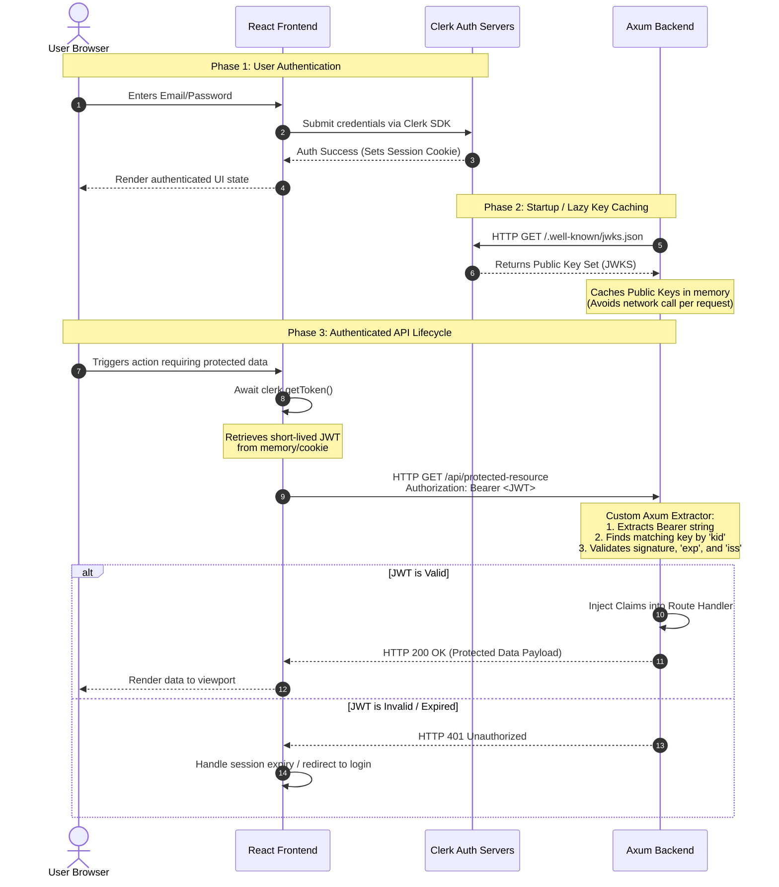

# Project Intent: Clerk Authentication Integration for agent-maker
## Executive Summary
The goal of this initiative is to integrate Clerk as the primary Authentication and Identity Provider into an existing full-stack monorepo agent-maker application. The architecture enforces a decoupling of responsibilities: the ReactJS frontend handles user interfaces, session state, and initial token acquisition, while the Rust Axum backend securely validates incoming operations statelessly using standard cryptography.

## Core Architecture & Token Lifecycle
To ensure maximum framework stability, minimal build bloat, and independence from third-party crate release cycles, the backend will omit vendor-specific SDKs (clerk-rs) and rely entirely on Pure JWT Verification.

## Technology Stack & Key Dependencies
- **Identity Provider:** Clerk (Email/Password authentication strategy).

- **Frontend Client:** ReactJS using @clerk/clerk-react.

- **Backend Server:** Rust Axum using standard ecosystem crates:

    - jsonwebtoken: For decoding tokens and cryptographic validation.

    - reqwest: For pulling Clerk's JSON Web Key Set (JWKS).

    - serde / serde_json: For deserializing token payloads.

    - tower-http: For robust CORS management (allowing Authorization headers).

## Operational Strategy (Phase-by-Phase)
### Phase 1: Configuration & Provisioning
- **Clerk Console:** Establish a new application environment, explicitly enabling the Email/Password authentication provider.

- **Environment Secret Distribution:**

    - **Frontend:** VITE_CLERK_PUBLISHABLE_KEY (or equivalent bundler prefix).
    - **Backend:** CLERK_JWKS_URL (pointing to your application's /.well-known/jwks.json endpoint) and CLERK_ISSUER string.

### Phase 2: React Frontend Blueprint
- **Context Layering:** Inject <ClerkProvider> at the root node of the client application.

- **UI Placement:** Render standard Clerk components (<SignIn/>, <SignUp/>, <UserButton/>) inside explicit, routed components.

- API Interceptor Pattern: Configure the global HTTP/Fetch client wrapper to asynchronously fetch the current session token utilizing Clerk’s useAuth().getToken() routine before injecting it directly into the Authorization: Bearer <TOKEN> header of every outgoing backend request.

### Phase 3: Rust Axum Backend Blueprint (Pure JWT)
- **Startup Cache Hook:** Construct an asynchronous startup utility that calls the CLERK_JWKS_URL to fetch Clerk's active public keys, deserializing them into a structured format to keep resident in application memory (axum::Extension or state).

- **Custom Axum Extractor:**

    1. Implement a custom struct struct Claims implementing Axum's FromRequestParts trait.

    2. Extract the string payload from the HTTP Authorization header.

    3. Look up the appropriate cryptographic key from the locally cached JWKS based on the incoming token header's kid (Key ID).

    4. Decode and evaluate the token signature, confirming expiry (exp) is in the future, and the issuer (iss) matches your project's unique Clerk instance.

- **Route Guarding:** Inject the Claims extractor into any target route handler requiring authentication.

## Security & Edge Case Guardrails
- **JWKS Key Rotation:** While the initial target will fetch keys at startup, the system design must eventually allow lazy re-fetching if a signature verification fails, accommodating Clerk's background key rotation schedules without server restarts.

- **CORS Hardening:** Axum’s tower-http::cors::CorsLayer must be strictly configured to allow the Authorization header and your specific frontend origin.

- **Database Alignment (Future Extension):** Should the backend require a localized mapping of user data (e.g., profiles, relational data), a dedicated, unauthenticated endpoint will be mapped out later to ingest secure, signature-verified Clerk Webhooks corresponding to user.created events.