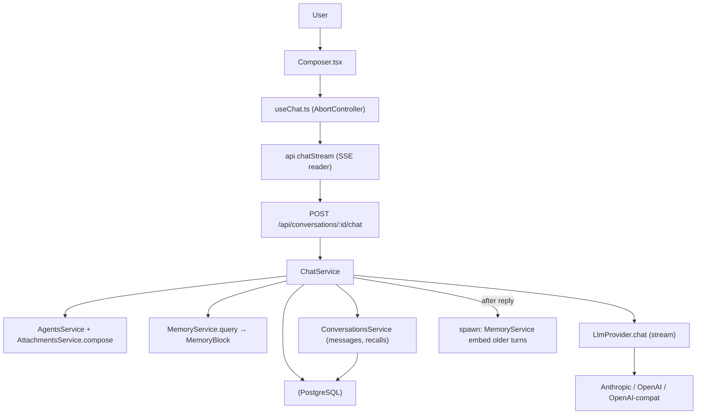

# F07. Chat Runtime — Technical Specification

## 1. Technical Overview

**What:** F07 is the live chat engine. It exposes a streaming endpoint that, for a
given conversation, composes one LLM request from four sources — the agent's
system prompt, the ordered attached skill bodies (F04 `compose`), the F08 memory
block (`MemoryService::query`), and the recent conversation tail — dispatches it
through the multi-provider abstraction (F01 `LlmProvider`), and streams the
assistant reply token-by-token to the browser over Server-Sent Events. It
persists user and assistant messages (F06), supports stopping an in-flight
stream and retrying a failed turn, attributes which older turns memory recalled
for each assistant message, and renders markdown with syntax-highlighted code.

**Why:** Every prior feature produces inputs that only become useful when an
actual model call is made. F07 is the integration point: it turns agents,
skills, conversations, and memory into a working chat. The provider trait
currently exposes only `test`; F07 extends it with a streaming `chat` method and
implements it for all three providers. No SSE exists in the codebase yet, so the
streaming transport, cancellation-on-disconnect, and partial-persistence
behaviors are introduced here.

**Scope:**

**Included:**
- Extend `LlmProvider` with a streaming `chat` method; implement for Anthropic,
  OpenAI, and OpenAI-compatible providers, surfacing token-usage when available.
- Prompt composer that assembles system prompt + ordered skill bodies + memory
  block ("Earlier relevant context" with timestamps and similarity) + recent
  conversation tail + current user message.
- `POST /api/conversations/:id/chat` returning `text/event-stream`; one in-flight
  request per conversation.
- Stop = client aborts the request; backend detects disconnect and persists the
  partial assistant message marked `stopped`.
- Retry = re-stream an assistant reply for the existing trailing user message
  without inserting a duplicate user row.
- Persist recalled-turn references per assistant message (new `message_recalls`
  table) so the "Recalled N earlier turns" indicator survives reload.
- Backend auto-spawns F08 embedding of older turns after each assistant reply
  completes (non-blocking).
- Context-window overflow handling: backend reduces retrieved K, then trims, until
  the composed prompt fits; fails with a clear message if still too large.
- Frontend composer (Enter sends, Shift+Enter newline, Cmd/Ctrl+K focus), streaming
  message rendering, Stop/Retry controls, per-message chip (model + approx tokens),
  recalled-turns expander, markdown + code highlighting.

**Excluded:**
- Tool use, multi-agent orchestration, attachments/vision (PRD Section 7).
- Changes to memory retrieval math (owned by F08) — F07 only consumes `query`.
- Provider key management UI (owned by F01/F02).

## 2. Architecture Impact

**Affected components:**
- `backend/src/llm/provider.rs` — extend trait with streaming `chat`, add chat DTOs.
- `backend/src/llm/anthropic.rs`, `openai.rs`, `openai_compat.rs` — implement `chat`.
- `backend/src/chat/` (new module) — `ChatService` (compose + dispatch + persist),
  prompt composition, context-fit reduction.
- `backend/src/routes/chat.rs` (new) — SSE endpoint, disconnect handling.
- `backend/src/conversations/service.rs` — message insert/update helpers, recall persistence.
- `backend/migrations/0003_message_recalls.sql` (new) — recall attribution table;
  add `finish_reason` to `messages`.
- `frontend/src/lib/api.ts` — `chatStream` async generator + chat DTO types.
- `frontend/src/hooks/useChat.ts` (new) — streaming mutation + abort + retry.
- `frontend/src/pages/Chat/` — `Composer.tsx` (new), `MessageList.tsx`,
  `MessageBubble.tsx` (new), `RecalledTurns.tsx` (new), `ChatPage.tsx`.



## 3. Technical Decisions

| Decision | Chosen Approach | Alternative Considered | Trade-off |
|----------|-----------------|------------------------|-----------|
| Streaming transport | Single `POST` returning `text/event-stream`; frontend reads the body with a `ReadableStream` reader and parses SSE frames | Two-step (POST creates turn, GET SSE) | One round trip and no in-flight registry; we accept manual SSE framing on a POST rather than using `axum::response::sse::Sse` (which pairs naturally with GET) |
| Stop / cancel | Client `AbortController` drops the connection; backend detects disconnect mid-stream and persists the partial as `stopped` | Explicit `POST /chat/stop` + server-side cancellation registry | No shared in-flight state to manage; we accept that "stop" is best-effort tied to connection teardown |
| Recalled-turn attribution | Persist references in `message_recalls` keyed to the assistant message | Stream-only ephemeral metadata | Indicator survives reload (F08 acceptance); we accept one extra table and writes per assistant turn |
| Embedding trigger | Backend `tokio::spawn` after assistant message persisted | Frontend calls `embed-pending` | Memory upkeep doesn't depend on the client; we accept fire-and-forget tasks (failures queue for next send, matching F08) |
| Retry semantics | Retry flag re-streams for the existing trailing user message; supersedes prior errored/stopped assistant message | Frontend resubmits content with backend dedupe | No duplicate user rows; we accept a small branch in the endpoint to skip user insert |
| Token count | Provider-reported usage when present; `chars/4` fallback | Always `chars/4` | More accurate chips for OpenAI/Anthropic; we accept parsing per-provider usage frames |
| Markdown rendering | `react-markdown` + `remark-gfm` + `rehype-highlight` | `marked` + `highlight.js` + sanitized HTML | React-idiomatic, no `dangerouslySetInnerHTML`; we accept added bundle weight |
| Context overflow | Iteratively drop retrieved turns (K→0), then drop oldest recent turns, re-checking a char-budget estimate; fail clearly if still over | Hard reject when over budget | Graceful degradation per PRD; we accept a heuristic char budget rather than exact tokenization |

## 4. Component Overview

**Backend:**

| File Path | New/Modified | Purpose | Key Responsibilities |
|-----------|--------------|---------|----------------------|
| `backend/src/llm/provider.rs` | Modified | Streaming contract | Add `chat` method to `LlmProvider`; define `ChatMessage`, `ChatRequest`, `ChatChunk`, `ChatUsage`, `ChatError` |
| `backend/src/llm/anthropic.rs` | Modified | Anthropic streaming | Map composed request to `/v1/messages` SSE; parse `content_block_delta` + `message_delta` usage |
| `backend/src/llm/openai.rs` | Modified | OpenAI streaming | Map to `/v1/chat/completions` with `stream:true`, `stream_options.include_usage`; parse delta + usage |
| `backend/src/llm/openai_compat.rs` | Modified | Local streaming | Same as OpenAI shape against configured base URL; tolerate missing usage |
| `backend/src/chat/mod.rs` | New | Module wiring | Re-export service + model |
| `backend/src/chat/model.rs` | New | Chat DTOs | `ChatStartRequest`, `ComposedPrompt`, `StreamEvent`, recall records |
| `backend/src/chat/service.rs` | New | Orchestration | Compose prompt, fit-to-context, dispatch stream, persist messages + recalls, spawn embedding |
| `backend/src/chat/compose.rs` | New | Prompt assembly | Build system block (agent + skills + "Earlier relevant context"); build message array from recent tail; char-budget reduction |
| `backend/src/routes/chat.rs` | New | HTTP/SSE | `POST /conversations/:id/chat`; stream `StreamEvent`s; detect disconnect; map errors to SSE `error` frame or HTTP error before stream start |
| `backend/src/routes/mod.rs` | Modified | Register routes | Merge `chat::routes()` |
| `backend/src/conversations/service.rs` | Modified | Persistence helpers | `insert_message`, `update_message` (content/status/model/tokens/finish_reason), `replace_trailing_assistant`, `insert_recalls`, `list_recalls` |
| `backend/src/lib.rs` | Modified | AppState | Add `ChatService` to `AppState` |

**Frontend:**

| File Path | New/Modified | Purpose | Key Responsibilities |
|-----------|--------------|---------|----------------------|
| `frontend/src/lib/api.ts` | Modified | API client | `chatStream` async generator (SSE parsing, abort signal); chat/recall DTO types |
| `frontend/src/hooks/useChat.ts` | New | Stream state | Manage in-flight send, accumulate chunks, expose `stop()`, `retry()`, streaming flag; invalidate messages on completion |
| `frontend/src/pages/Chat/Composer.tsx` | New | Input | Textarea, Enter/Shift+Enter/Cmd-K, send/stop button, "one in-flight" inline notice, draft integration |
| `frontend/src/pages/Chat/MessageBubble.tsx` | New | Message render | Markdown + code highlight, status indicator, model/token chip, retry link on error/stopped |
| `frontend/src/pages/Chat/RecalledTurns.tsx` | New | Memory indicator | "Recalled N earlier turns" expander with timestamps + similarity |
| `frontend/src/pages/Chat/MessageList.tsx` | Modified | List | Render bubbles incl. live streaming message; remove F07 placeholder |
| `frontend/src/pages/Chat/ChatPage.tsx` | Modified | Wire-up | Replace placeholder composer with `Composer` + `useChat`; "memory unavailable" notice on degraded |

**Database:**

| Migration File | Tables Affected | Operation | Notes |
|----------------|-----------------|-----------|-------|
| `backend/migrations/0003_message_recalls.sql` | `message_recalls` (new), `messages` | CREATE + ALTER | New recall attribution table; add nullable `finish_reason` to `messages` |

## 5. API Contracts

### Endpoint: Stream a chat turn
- **Method:** POST
- **Path:** `/api/conversations/:id/chat`
- **Authentication:** None (local-only app)
- **Response content-type:** `text/event-stream` (on success); `application/json` error body if the request fails before streaming begins (e.g., conversation not found, in-flight conflict, provider auth on preflight).

**Request:**

| Field | Type | Required | Validation | Description |
|-------|------|----------|------------|-------------|
| `content` | `string` | Conditional | 1–20000 chars; required unless `retry` is true | New user message text |
| `retry` | `boolean` | No | default `false` | When true, omit `content`; re-stream for the existing trailing user message |
| `recent_n` | `integer` | No | [4, 30] | Per-request memory override (else agent/global) |
| `top_k` | `integer` | No | [0, 10] | Per-request memory override (else agent/global) |

**Request Example:**
```json
{ "content": "Summarize our decisions so far." }
```

**Response (SSE event stream):** each frame is `data: <json>\n\n`. Event objects:

| `type` | Fields | Description |
|--------|--------|-------------|
| `meta` | `user_message_id`, `assistant_message_id`, `model`, `degraded`, `degraded_reason`, `recalled[]` | Emitted once before chunks. `recalled[]`: `{ message_id, role, content, created_at, similarity }` |
| `chunk` | `content` | Token/text delta appended to the assistant message |
| `done` | `status` (`complete`\|`stopped`), `token_count`, `finish_reason` | Final frame; assistant message persisted |
| `error` | `code`, `message`, `provider?` | Mid-stream provider/IO failure; assistant turn saved as `error` |

**Meta Example:**
```json
{
  "type": "meta",
  "user_message_id": "1f...",
  "assistant_message_id": "2a...",
  "model": "claude-sonnet-4-6",
  "degraded": false,
  "degraded_reason": null,
  "recalled": [
    { "message_id": "0c...", "role": "user", "content": "Earlier we agreed...", "created_at": "2026-05-20T10:00:00Z", "similarity": 0.83 }
  ]
}
```

**Done Example:**
```json
{ "type": "done", "status": "complete", "token_count": 412, "finish_reason": "end_turn" }
```

**Error Codes (pre-stream JSON body, existing `AppError` shape):**

| Code | HTTP Status | Description |
|------|-------------|-------------|
| `validation_error` | 400 | Missing `content` without `retry`; out-of-range overrides; retry with no trailing user message |
| `not_found` | 404 | Conversation does not exist |
| `conflict` | 409 | A response is already streaming for this conversation |
| `provider_error` | provider status (401/404/5xx) | Provider rejected the preflight (e.g., invalid key, unknown model) |
| `context_too_large` | 422 | Composed prompt exceeds the model budget even after reducing K and trimming |

(Provider failures that occur *after* streaming starts are delivered as an SSE `error` frame, not an HTTP status.)

### Endpoint: List messages (extended)
- **Method:** GET
- **Path:** `/api/conversations/:id/messages` (existing F06 endpoint, extended)
- Each assistant message gains an optional `recalled` array (from `message_recalls`) and `finish_reason`, so the recalled-turns indicator renders after reload.

**Response addition Example:**
```json
{
  "id": "2a...", "role": "assistant", "content": "...", "status": "complete",
  "model": "gpt-4o", "token_count": 412, "finish_reason": "stop",
  "recalled": [ { "message_id": "0c...", "role": "user", "content": "...", "created_at": "2026-05-20T10:00:00Z", "similarity": 0.83 } ]
}
```

## 6. Data Model

**Table: `message_recalls`**

| Column | Type | Nullable | Default | Description |
|--------|------|----------|---------|-------------|
| `assistant_message_id` | `uuid` | No | - | The assistant message these recalls were composed for |
| `recalled_message_id` | `uuid` | No | - | An older message that was retrieved |
| `similarity` | `real` | No | - | Cosine similarity at retrieval time |
| `position` | `integer` | No | - | Order within the recalled set (0-based) |

**Indexes:**

| Index Name | Columns | Type | Purpose |
|------------|---------|------|---------|
| `idx_message_recalls_assistant` | `assistant_message_id` | btree | Fetch recalls for a message |

**Constraints:**

| Constraint | Type | Definition | Purpose |
|------------|------|------------|---------|
| `pk_message_recalls` | PRIMARY KEY | `(assistant_message_id, recalled_message_id)` | Uniqueness per pair |
| `fk_recalls_assistant` | FOREIGN KEY | `assistant_message_id REFERENCES messages(id) ON DELETE CASCADE` | Cleanup with message |
| `fk_recalls_recalled` | FOREIGN KEY | `recalled_message_id REFERENCES messages(id) ON DELETE CASCADE` | Cleanup with message |

**Alter: `messages`**

| Column | Type | Nullable | Default | Description |
|--------|------|----------|---------|-------------|
| `finish_reason` | `text` | Yes | `NULL` | Provider finish reason (`end_turn`/`stop`/`max_tokens`/`error`) |

**Migration Example:**
```sql
ALTER TABLE messages ADD COLUMN finish_reason TEXT;

CREATE TABLE message_recalls (
    assistant_message_id UUID NOT NULL REFERENCES messages (id) ON DELETE CASCADE,
    recalled_message_id  UUID NOT NULL REFERENCES messages (id) ON DELETE CASCADE,
    similarity           REAL NOT NULL,
    position             INTEGER NOT NULL,
    PRIMARY KEY (assistant_message_id, recalled_message_id)
);

CREATE INDEX idx_message_recalls_assistant ON message_recalls (assistant_message_id);
```

## 7. Testing Strategy

**Test File Structure:**

| Test File | Test Type | Target | Coverage Goal |
|-----------|-----------|--------|---------------|
| `backend/tests/chat.rs` | Integration | `/chat` endpoint + composition + persistence | Core paths |
| `backend/src/chat/compose.rs` (unit `#[cfg(test)]`) | Unit | Prompt assembly + context reduction | High |
| `frontend/src/pages/Chat/Composer.test.tsx` | Component | Composer behavior | Core paths |
| `frontend/src/hooks/useChat.test.ts` | Unit | Stream accumulation, stop, retry | Core paths |
| `frontend/src/pages/Chat/MessageBubble.test.tsx` | Component | Markdown, chip, retry, recalled | Core paths |

Provider streaming in backend tests uses a stub `LlmProvider` implementation (mock chat stream) injected into `AppState`, mirroring the file-backed secrets pattern in existing tests; no live network calls.

**Backend `tests/chat.rs`:**

| Test Function | Description | Assertions |
|---------------|-------------|------------|
| `test_chat_streams_and_persists` | Send a message against a stub provider | SSE yields `meta`→`chunk`*→`done`; user + assistant rows persisted; assistant `status=complete` |
| `test_compose_order_system_skills_memory_tail` | Verify composed prompt order | System = agent prompt + skill bodies in position order + "Earlier relevant context"; messages end with current user msg (covers F07 + cross-feature criteria) |
| `test_skill_edit_changes_next_prompt` | Edit a skill body then chat | Composed system block reflects updated body (cross-feature criterion) |
| `test_per_agent_provider_model_overrides_default` | Agent with explicit provider/model | Dispatch uses agent provider/model + per-agent key fallback (cross-feature criterion) |
| `test_in_flight_conflict_blocked` | Second chat while one streams | Second request returns 409 `conflict` |
| `test_retry_no_duplicate_user` | Retry after an error turn | No new user row; prior assistant superseded; new assistant streamed |
| `test_stop_persists_partial` | Client disconnects mid-stream | Partial assistant saved with `status=stopped` |
| `test_recalls_persisted_and_listed` | Chat with retrieval, then GET messages | `message_recalls` rows written; messages response includes `recalled[]` (F08 indicator persistence) |
| `test_memory_degraded_falls_back` | Force retrieval failure | `meta.degraded=true`; response still completes (cross-feature + F08 criterion) |
| `test_context_too_large` | Oversized composed prompt | After K reduction still over → 422 `context_too_large` |
| `test_provider_4xx_preflight` | Stub provider returns auth error pre-stream | HTTP `provider_error` with provider message |

**Frontend:**

| Test Function | Description | Assertions |
|---------------|-------------|------------|
| `composer sends on Enter, newline on Shift+Enter` | Key handling | Enter triggers send; Shift+Enter inserts `\n` |
| `blocks send while streaming with notice` | In-flight guard | Send disabled/replaced by Stop; inline notice shown |
| `renders streamed chunks incrementally` | `useChat` accumulation | Bubble text grows as chunks arrive |
| `stop halts stream` | Abort | `stop()` aborts; partial text remains |
| `error turn shows retry and preserves message` | Error path | Red bubble + Retry; user message preserved |
| `assistant chip shows model and token count` | Chip | Renders model + approx tokens |
| `markdown and code render highlighted` | Rendering | Code block gets highlight markup; no raw HTML injection |
| `recalled turns expander lists timestamps and similarity` | Indicator | Expands to retrieved turns from `recalled[]` |

## 8. Assumptions & Decisions

- **Interview-confirmed:** POST→SSE with abort-on-disconnect stop; backend auto-spawns
  embedding; `react-markdown`+`remark-gfm`+`rehype-highlight`; provider-usage token
  count with `chars/4` fallback; recalls persisted per assistant message; retry reuses
  the trailing user message.
- **Scope:** F07 has no Core/Full split in the PRD → full feature specced.
- **Context budget:** reuses the existing `model_context_chars` heuristic from F04
  `compose` (chars-based), not exact tokenization — acceptable for v1 per PRD's
  "automatically reduces retrieved older turns until it fits".
- **In-flight guard:** "one in-flight request per conversation" enforced via a process-local
  set of streaming conversation ids (single-user local app; no multi-instance concern).
- **PRD traceability:** Capabilities → §3/§4/§5 behavior; Experience → frontend components in §4;
  Error Handling → §5 error table + SSE `error` frame; Section 9 F07 + Cross-Feature criteria → §7 tests.
- **Consumes/Provides:** consumes F02 agent, F04 `compose`, F06 history, F08 `MemoryBlock`,
  F01 providers; provides persisted user/assistant messages (F06/F08) — reflected in §2 and §5.
