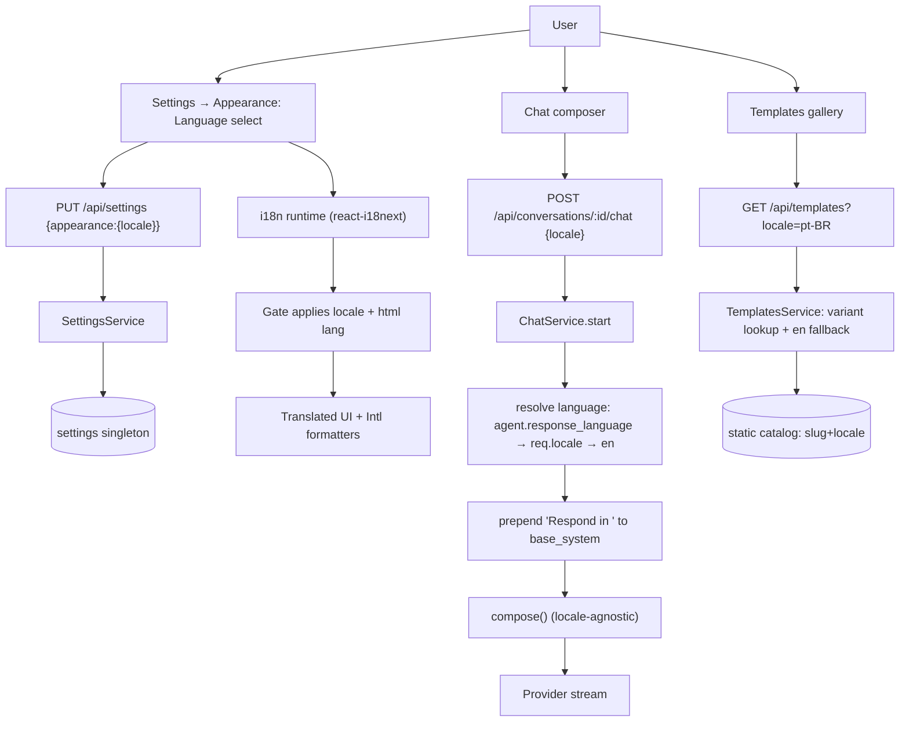

# Technical Specification: F09. Internationalization (i18n)

## Section 1: Technical Overview

**What:** Add a locale layer across the whole product. The frontend gains a react-i18next translation runtime, locale-aware date/number formatting, and a Language selector in Settings. The backend stores the active UI `locale` on the settings singleton and a per-agent `response_language`, serves locale-matched starter templates, and injects a "Respond in <language>" directive into the chat prompt. v1 supported locales: English (`en`) and Brazilian Portuguese (`pt-BR`); the catalog architecture accepts more locales without code changes.

**Why:** All UI text is currently hardcoded across components and there is no translation mechanism. Templates are English-only compile-time arrays, and the chat composer has no notion of a response language. F09 introduces the shared locale primitives the rest of the app reads from, while preserving the existing singleton-settings, compile-time-catalog, and pure-`compose()` idioms.

**Scope:**

**Included:**
- Frontend i18n runtime (react-i18next) with `en` + `pt-BR` message catalogs covering all UI chrome: navigation, buttons, form labels/placeholders, validation and error messages, toasts, confirmation modals, empty states.
- Locale resolution on first launch: persisted setting → `navigator.language` (mapped to nearest supported) → `en` fallback.
- `locale` persisted on the settings singleton (within `Appearance`), applied app-wide via the existing `Gate` component without flicker.
- Centralized locale-aware date/number formatting helpers replacing scattered `toLocaleString()` calls.
- Localized starter templates (F05): per-locale `name`/`description`/`preamble`/`system_prompt`/`body`, selected by active locale with `en` fallback and a fallback badge.
- Per-agent `response_language` setting (`auto` or a specific locale); `auto` follows the UI locale.
- Locale-aware agent responses: ChatService prepends a language directive to the composed system prompt.

**Excluded (out of scope for F09):**
- RTL layout support; no v1 locale requires it.
- Translating user-authored content (agent prompts, skill bodies, chat history).
- Locale-specific model/provider selection.
- Server-rendered/localized API error message catalogs — backend error **codes** stay stable and English; the frontend maps codes to localized strings.

---

## Section 2: Architecture Impact

**Affected components:**

- Frontend runtime: `frontend/src/i18n/` (new), `frontend/src/App.tsx`, `frontend/src/router.tsx` (Gate), `frontend/src/hooks/useTheme.ts` sibling locale hook, `frontend/src/lib/api.ts`.
- Frontend views: `frontend/src/pages/Settings/Appearance.tsx`, `Agents/*` form, plus all components holding hardcoded strings (toasts, titles, modals).
- Frontend formatting: `frontend/src/lib/format.ts` (new) consumed by `Chat/ConversationSidebar.tsx`, `Chat/RecalledTurns.tsx`, `Agents/ComposedPromptIndicator.tsx`.
- Backend settings: `backend/src/settings/model.rs`, `settings/service.rs`.
- Backend agents: `backend/src/agents/model.rs`, `agents/service.rs`.
- Backend templates: `backend/src/templates/catalog.rs`, `templates/model.rs`, `templates/service.rs`, `routes/templates.rs`.
- Backend chat: `backend/src/chat/service.rs`, `chat/model.rs`.
- Migration: `backend/migrations/0006_i18n.sql`.



---

## Section 3: Technical Decisions

| Decision | Chosen Approach | Alternative Considered | Trade-off |
|----------|----------------|------------------------|-----------|
| Frontend i18n library | react-i18next + i18next-browser-languagedetector | FormatJS/react-intl; lightweight custom context | Adds dependencies, but gets detection, interpolation, pluralization, and namespace lazy-loading for free; matches the "full localization" scope. |
| Template locale storage | Parallel static catalogs keyed by `slug` + locale, `en` fallback | New `template_locales` DB table seeded via migration | Keeps the compile-time, offline, type-safe F05 design; cost is duplicated static data per locale and a recompile to add content. |
| Date/number formatting | Centralized helpers over native `Intl.DateTimeFormat`/`Intl.NumberFormat` | date-fns + locale packs | No new dependency; `Intl` already covers v1 needs; cost is hand-written helpers vs library conveniences (relative time). |
| Auto response-language resolution | Chat request carries active UI locale; backend resolves agent override → request locale → `en` | Backend reads UI locale from the settings singleton | Keeps agents portable and chat decoupled from global UI state; cost is one extra request field. |
| Directive injection site | ChatService prepends directive to `base_system` before `compose()` | Pass `language` param into `compose()` | Keeps `compose.rs` pure and locale-agnostic (matches codebase idiom of handling locale upstream); cost is the directive lives outside the central prompt builder. |
| Locale code format | BCP 47 strings (`en`, `pt-BR`) in DB/API | snake_case (`pt_br`) | Standard, matches `navigator.language`; underscore form only used for module/file names where needed. |

---

## Section 4: Component Overview

**Frontend:**

| File Path | New/Modified | Purpose | Key Responsibilities |
|-----------|--------------|---------|----------------------|
| `src/i18n/index.ts` | New | i18next bootstrap | Configure react-i18next, register catalogs, wire language detector, set fallback `en` |
| `src/i18n/locales/en.json` | New | English catalog | All UI chrome strings, namespaced (common, settings, agents, chat, templates, errors) |
| `src/i18n/locales/pt-BR.json` | New | Portuguese catalog | Same keys as `en.json`, translated |
| `src/i18n/locales/supported.ts` | New | Locale registry | List of supported locales with native display names; `navigator.language` → nearest-supported mapping |
| `src/hooks/useLocale.ts` | New | Locale hook | Read active locale, expose setter that persists via settings mutation and calls `i18n.changeLanguage` |
| `src/lib/format.ts` | New | Formatters | `formatDate`, `formatDateTime`, `formatPercent`, `formatNumber` taking the active locale |
| `src/App.tsx` | Modified | Provider tree | Import `./i18n` to initialize before render |
| `src/router.tsx` | Modified | Gate | After settings load, apply locale (set `i18n` language + `<html lang>`) alongside `useApplyTheme` |
| `src/lib/api.ts` | Modified | API types/calls | Add `locale` to settings types; add `locale` to chat start payload; add `locale` query param to templates list; add `response_language` to agent types |
| `src/pages/Settings/Appearance.tsx` | Modified | Settings UI | Add Language `<Select>` listing native names; persist on change |
| `src/pages/Agents/*` (form) | Modified | Agent form | Add Response Language dropdown (default "Automatic") |
| Components with hardcoded text | Modified | UI chrome | Replace literals with `t()` keys (e.g., `ConversationSidebar`, `ComposedPromptIndicator`, `router` states, toasts) |

**Backend:**

| File Path | New/Modified | Purpose | Key Responsibilities |
|-----------|--------------|---------|----------------------|
| `src/settings/model.rs` | Modified | Settings DTOs | Add `locale` to `Appearance` and `AppearanceUpdate` |
| `src/settings/service.rs` | Modified | Settings logic | Validate `locale` against supported set; read/write `locale` column |
| `src/agents/model.rs` | Modified | Agent DTOs | Add `response_language` to `Agent`, `AgentResponse`, `AgentUpsert` |
| `src/agents/service.rs` | Modified | Agent logic | Validate `response_language` (`auto` or supported locale); persist on create/update/clone |
| `src/templates/model.rs` | Modified | Template types | Add locale-variant lookup type; keep DTO shape stable |
| `src/templates/catalog.rs` | Modified | Static catalog | Add `pt-BR` variant tables keyed by slug; lookup helper with `en` fallback |
| `src/templates/service.rs` | Modified | Template logic | Accept `locale`, return matched variant + `is_fallback` flag |
| `src/routes/templates.rs` | Modified | Templates route | Parse `?locale=` query param, pass to service |
| `src/chat/model.rs` | Modified | Chat request | Add `locale: Option<String>` to `ChatStartRequest` |
| `src/chat/service.rs` | Modified | Chat logic | Resolve response language; prepend directive to `base_system` before `compose()` |
| `src/i18n.rs` | New | Locale constants | `SUPPORTED_LOCALES`, `language_name(locale)`, validation helper shared by settings/agents/chat |

**Database:**

| Migration File | Tables Affected | Operation | Notes |
|----------------|-----------------|-----------|-------|
| `0006_i18n.sql` | `settings`, `agents` | ALTER | Add `settings.locale` (default `en`) and `agents.response_language` (default `auto`) |

---

## Section 5: API Contracts

All endpoints already exist; F09 extends payloads. Authentication: none (single-user, localhost — matches F01).

### Endpoint: Update Settings (extended)
- **Method:** PUT
- **Path:** `/api/settings`

**Request (relevant subset):**

| Field | Type | Required | Validation | Description |
|-------|------|----------|------------|-------------|
| `appearance.locale` | `string` | No | one of supported locales (`en`, `pt-BR`) | Active UI locale |
| `appearance.theme` | `string` | No | `light`/`dark`/`system` | Existing field, unchanged |

**Request Example:**
```json
{ "appearance": { "locale": "pt-BR" } }
```

**Response (200) — `appearance` subset:**

| Field | Type | Description |
|-------|------|-------------|
| `appearance.theme` | `string` | Current theme |
| `appearance.locale` | `string` | Current locale |

**Response Example:**
```json
{ "appearance": { "theme": "system", "locale": "pt-BR" } }
```

**Error Codes:**

| Code | HTTP Status | Description |
|------|-------------|-------------|
| `validation_error` | 400 | `locale` not in supported set |

### Endpoint: List Templates (extended)
- **Method:** GET
- **Path:** `/api/templates?locale=pt-BR`

**Request:**

| Field | Type | Required | Validation | Description |
|-------|------|----------|------------|-------------|
| `locale` | query string | No | supported locale; defaults to `en` | Desired template variant locale |
| `category` | query string | No | existing filter | Unchanged |

**Response (200) — per template item adds:**

| Field | Type | Description |
|-------|------|-------------|
| `is_fallback` | `boolean` | `true` when the `en` variant was returned because no translation exists for the requested locale |

**Response Example:**
```json
{
  "agents": [
    { "slug": "writing-editor", "name": "Editor de Texto", "category": "writing", "is_fallback": false }
  ],
  "skills": [
    { "slug": "concise-tone", "name": "Concise Tone", "description": "...", "category": "writing", "is_fallback": true }
  ]
}
```

### Endpoint: Start Chat (extended)
- **Method:** POST
- **Path:** `/api/conversations/:id/chat`

**Request:**

| Field | Type | Required | Validation | Description |
|-------|------|----------|------------|-------------|
| `content` | `string` | No | existing | New user message |
| `retry` | `boolean` | No | existing | Retry trailing user message |
| `locale` | `string` | No | supported locale | Active UI locale; used when the agent's `response_language` is `auto` |

**Request Example:**
```json
{ "content": "Resuma este texto", "locale": "pt-BR" }
```

Resolution order applied server-side: `agent.response_language` (if a specific locale) → `req.locale` → `en`. When the resolved language is `en`, no directive is added.

### Endpoint: Create/Update Agent (extended)
- **Method:** POST/PUT
- **Path:** `/api/agents`, `/api/agents/:id`

**Request adds:**

| Field | Type | Required | Validation | Description |
|-------|------|----------|------------|-------------|
| `response_language` | `string` | No | `auto` or supported locale; defaults `auto` | Per-agent response language override |

**Response adds:** `response_language` on the agent object.

---

## Section 6: Data Model

**Table: `settings` (ALTER)**

| Column | Type | Nullable | Default | Description |
|--------|------|----------|---------|-------------|
| `locale` | `text` | No | `'en'` | Active UI locale; `CHECK (locale IN ('en','pt-BR'))` |

**Table: `agents` (ALTER)**

| Column | Type | Nullable | Default | Description |
|--------|------|----------|---------|-------------|
| `response_language` | `text` | No | `'auto'` | `auto` follows UI locale, else a specific locale; `CHECK (response_language IN ('auto','en','pt-BR'))` |

**Constraints:**

| Constraint | Type | Definition | Purpose |
|------------|------|------------|---------|
| `ck_settings_locale` | CHECK | `locale IN ('en','pt-BR')` | Bound to supported set; mirrors existing `theme` CHECK pattern |
| `ck_agents_response_language` | CHECK | `response_language IN ('auto','en','pt-BR')` | Bound to `auto` + supported set |

**Migration Example:**
```sql
-- 0006_i18n.sql
ALTER TABLE settings
    ADD COLUMN locale TEXT NOT NULL DEFAULT 'en'
    CHECK (locale IN ('en','pt-BR'));

ALTER TABLE agents
    ADD COLUMN response_language TEXT NOT NULL DEFAULT 'auto'
    CHECK (response_language IN ('auto','en','pt-BR'));
```

> Note on extensibility: adding a locale means updating the CHECK constraints (a new migration), the supported-locale registries (`src/i18n.rs`, `supported.ts`), a new frontend catalog file, and optional template variants. The PRD's "no code changes to add a locale" goal is satisfied for the frontend catalog layer (drop-in JSON + registry entry); DB CHECK widening is the one backend touch point.

---

## Section 7: Testing Strategy

**Test File Structure:**

| Test File | Test Type | Target | Coverage Goal |
|-----------|-----------|--------|---------------|
| `backend/tests/settings.rs` | Integration | locale persistence/validation | acceptance |
| `backend/tests/agents.rs` | Integration | `response_language` round-trip | acceptance |
| `backend/tests/templates.rs` | Integration | locale variant + fallback | acceptance |
| `backend/tests/chat.rs` | Integration | directive resolution | acceptance |
| `backend/src/i18n.rs` (unit) | Unit | locale validation, `language_name` | 90% |
| `frontend/src/i18n/supported.test.ts` | Unit | `navigator.language` mapping | 90% |
| `frontend/src/lib/format.test.ts` | Unit | locale-aware formatters | 90% |
| `frontend/src/hooks/useLocale.test.ts` | Unit | switch persists + changes i18n | 80% |
| `frontend/src/pages/Settings/Appearance.test.tsx` | Component | Language select renders/updates | 80% |

**Backend test functions:**

| Test Function | Description | Assertions |
|---------------|-------------|------------|
| `update_locale_persists` | PUT settings with `pt-BR` | reload returns `pt-BR` |
| `update_locale_rejects_unsupported` | PUT `xx-YY` | 400 `validation_error`, value unchanged |
| `agent_response_language_round_trip` | create with `pt-BR`, default `auto` | persisted; default applied when omitted |
| `agent_response_language_rejects_invalid` | create with bad value | 400 `validation_error` |
| `templates_returns_locale_variant` | GET `?locale=pt-BR` | translated `name`, `is_fallback=false` |
| `templates_falls_back_to_en` | GET `?locale=pt-BR` for untranslated slug | `en` content, `is_fallback=true` |
| `chat_auto_uses_request_locale` | agent `auto`, request `pt-BR` | composed system contains directive for Portuguese |
| `chat_agent_override_wins` | agent `pt-BR`, request `en` | directive for Portuguese regardless of request |
| `chat_english_adds_no_directive` | resolved `en` | system prompt unchanged (no directive) |

**Frontend test functions:**

| Test Function | Description | Assertions |
|---------------|-------------|------------|
| `maps_browser_language_to_supported` | `pt-BR`, `pt`, `pt-PT`, `fr` inputs | first three → `pt-BR`, unknown → `en` |
| `missing_key_falls_back_to_en` | render with `pt-BR` missing a key | English string shown, never raw key |
| `formats_date_per_locale` | same ISO in `en` vs `pt-BR` | locale-distinct output |
| `language_select_persists_and_switches` | choose Português | mutation called with `{appearance:{locale}}`, `i18n.changeLanguage` invoked |

**Acceptance coverage mapping (PRD §9 F09):**
- Language selector lists `en`+`pt-BR` by native name, persists → `Appearance.test.tsx` + `update_locale_persists`.
- Browser-language default with `en` fallback → `maps_browser_language_to_supported`.
- UI updates immediately without reload → `language_select_persists_and_switches`.
- Locale-aware date/number formatting → `formats_date_per_locale`.
- Locale-matched templates + fallback indicator → `templates_returns_locale_variant`, `templates_falls_back_to_en`.
- Automatic directive uses UI locale → `chat_auto_uses_request_locale`.
- Per-agent override forces language → `chat_agent_override_wins`.
- Missing key renders English, never a raw key → `missing_key_falls_back_to_en`.
- Offline language switch + template localization → static catalogs + bundled JSON (no network); covered implicitly by the unit/integration suites running without external calls.

**Cross-Feature Integration (PRD §9):** "active locale propagates into the F07 prompt as a response-language directive and selects the F05 template variant" → `chat_auto_uses_request_locale` + `templates_returns_locale_variant`.

---

## Assumptions & Decisions

- **Locale set fixed to `en` + `pt-BR` for v1** (PRD). New locales widen the two CHECK constraints via a follow-up migration plus a drop-in frontend catalog + registry entry.
- **`response_language` default is `auto`**, resolving to the UI locale at request time; chosen over defaulting to `en` so existing/new agents follow the user's language without per-agent setup (PRD: "reply in my chosen language by default").
- **API error messages remain English; only stable error codes cross the boundary.** The frontend localizes by mapping codes to catalog strings. This avoids a backend message-catalog system the PRD does not require.
- **No RTL support** — neither v1 locale needs it.
- **Templates recompile to gain new translated content** — accepted trade-off of keeping the compile-time catalog design from F05.
