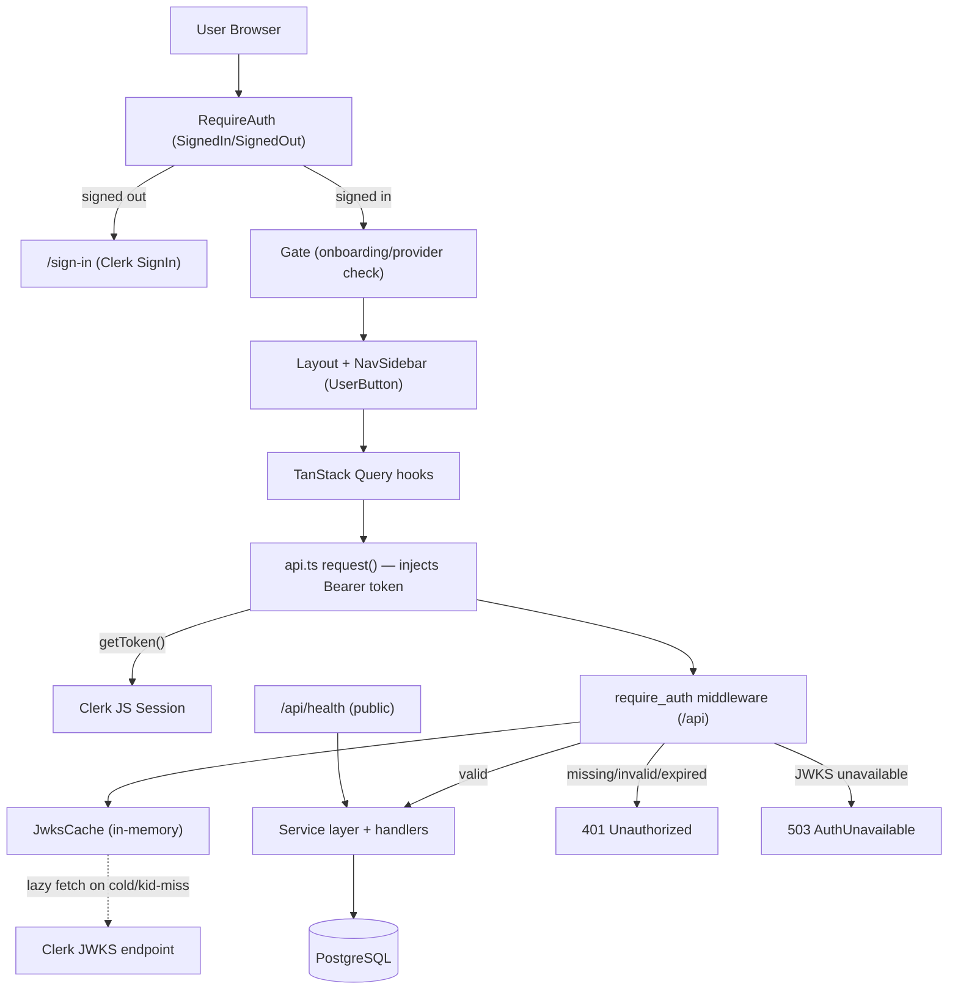

# F10. Authentication and Login (Clerk) — Technical Specification

## 1. Technical Overview

**What:** Add a Clerk-backed authentication login wall over the existing agent-maker app. The React frontend mounts `<ClerkProvider>`, exposes `/sign-in` and `/sign-up` routes rendering Clerk's hosted components, guards every other route behind a signed-in session, and injects `Authorization: Bearer <jwt>` into the single `request()` fetch wrapper. The Rust/Axum backend adds a self-contained `auth` module that performs **pure JWT verification** (no `clerk-rs`): it caches Clerk's JWKS in memory, exposes a `Claims` extractor, and applies a `require_auth` middleware layer to the protected `/api` routes.

**Why:** The product is moving from "no authentication" to a single-tenant login wall. The backend must reject unauthenticated/expired requests statelessly (`401`) without a vendor SDK and without per-request network calls (JWKS cached, lazy re-fetch only on key rotation). The frontend must require a session before any protected screen and refresh tokens transparently via Clerk.

**Scope:**

**Included:**
- Frontend: `ClerkProvider`, `/sign-in/*` and `/sign-up/*` routes, an auth guard (`RequireAuth`) that wraps the existing `Gate`, bearer-token injection into `api.ts`, a `<UserButton/>` + signed-in identity in `NavSidebar`, `auth` i18n namespace (`en` + `pt-BR`), and `VITE_CLERK_PUBLISHABLE_KEY` wiring.
- Backend: a new `auth` module (JWKS cache + `Claims` `FromRequestParts` extractor + `require_auth` middleware), an `AppError::Unauthorized` (401) and `AppError::AuthUnavailable` (503) variant, a configurable `CorsLayer`, and `CLERK_JWKS_URL` / `CLERK_ISSUER` / `CORS_ALLOWED_ORIGIN` config.
- A shared single workspace gated by auth — **no per-user data isolation, no new DB tables, no `owner_id` columns**.

**Excluded:**
- Per-user data scoping, roles/permissions, organizations (PRD Section 7).
- Any `/api/auth/*` login/logout/webhook endpoints — login happens entirely on the Clerk frontend; the backend only verifies tokens. Clerk `user.created` webhook ingestion is a documented future extension, not in scope.
- No new database migration.

## 2. Architecture Impact

**Affected components:**

Backend (`backend/`):
- `src/auth/mod.rs` (new) — module wiring + `AuthConfig`/`AuthState`.
- `src/auth/jwks.rs` (new) — JWKS cache, fetch, lazy refresh, key lookup by `kid`.
- `src/auth/claims.rs` (new) — `Claims` struct + `FromRequestParts` extractor.
- `src/auth/middleware.rs` (new) — `require_auth` `from_fn` layer.
- `src/config.rs` (modified) — add `clerk_jwks_url`, `clerk_issuer`, `cors_allowed_origin`.
- `src/error.rs` (modified) — add `Unauthorized` (401) and `AuthUnavailable` (503).
- `src/lib.rs` (modified) — build `AuthState`, place it in `AppState`, register CORS.
- `src/routes/mod.rs` (modified) — split public vs protected routers; layer `require_auth` on protected; add `CorsLayer`.
- `src/routes/settings.rs` (modified) — relocate the `/health` route registration to the public router (handler unchanged).
- `Cargo.toml` (modified) — add `jsonwebtoken`.

Frontend (`frontend/`):
- `src/main.tsx` or `src/App.tsx` (modified) — mount `<ClerkProvider>` (conditional on publishable key).
- `src/pages/SignIn.tsx`, `src/pages/SignUp.tsx` (new) — Clerk `<SignIn/>` / `<SignUp/>`.
- `src/components/RequireAuth.tsx` (new) — Clerk `<SignedIn>/<SignedOut>` guard wrapping `Gate`.
- `src/components/ClerkTokenBridge.tsx` (new) — registers Clerk `getToken` with the api layer.
- `src/router.tsx` (modified) — add public auth routes; wrap protected group with `RequireAuth`.
- `src/lib/api.ts` (modified) — module-level token getter + 401 handler in `request()`.
- `src/components/NavSidebar.tsx` (modified) — `<UserButton/>` + signed-in identity.
- `src/i18n/locales/en.json`, `pt-BR.json` (modified) — `auth` namespace.



## 3. Technical Decisions

| Decision | Chosen Approach | Alternative Considered | Trade-off |
|----------|-----------------|------------------------|-----------|
| Backend guard placement | `require_auth` `from_fn_with_state` layer applied to the protected `/api` sub-router; a `Claims` `FromRequestParts` extractor reads the validated claims from request extensions for handlers that need identity | Per-handler `Claims` extractor on every handler | One guard point can't be forgotten on new routes; handlers stay unchanged. Accept: guard logic lives in middleware, slightly less explicit per-route. |
| Public-route carve-out | Split router into a public sub-router (`/health`) and a protected sub-router (everything else); layer `require_auth` on the protected sub-router only, then merge | Path-string skip inside the middleware (`path == "/health"`) | Robust, not brittle to axum's nested-prefix stripping. Accept: relocating the health route registration out of `settings::routes()`. |
| Token verification library | `jsonwebtoken` with RS256, `validate_exp`, `set_issuer([CLERK_ISSUER])`; audience not validated (Clerk session tokens use `azp`, not `aud`) | `clerk-rs` SDK | No vendor lock-in or crate-release coupling (per `auth-intent.md`). Accept: we implement JWKS parsing/caching ourselves. |
| JWKS caching & rotation | In-memory `RwLock<HashMap<kid, DecodingKey>>`; lazy fetch when cold or on `kid` miss / signature failure, then one retry before rejecting | Fetch-per-request, or fixed TTL refresh | No network call on the hot path; tolerates Clerk key rotation without restart. Accept: a cold first request pays one fetch. |
| Auth enable/disable gating | Auth is **enforced iff** both `CLERK_JWKS_URL` and `CLERK_ISSUER` are set. With both unset, the middleware is a pass-through (logs a warning once) — preserving local dev and the existing test suite. With exactly one set, the app **fails fast at startup** with a clear config error | Always-on with a separate `DISABLE_AUTH` flag | Existing `#[sqlx::test]` integration tests run unchanged (no Clerk env → disabled); production enables by setting both vars. Accept: deployments MUST set both; documented in `plan.md` prerequisites and `deployment.md`. |
| Frontend provider gating | `<ClerkProvider>` and `RequireAuth` are active only when `VITE_CLERK_PUBLISHABLE_KEY` is present; absent → render children directly (auth disabled) | Always require the key | Mirrors backend disabled-mode so local dev needs no Clerk account. Accept: a misconfigured prod frontend without the key would silently disable the wall — covered by deployment checklist. |
| Bearer token retrieval in `request()` | Module-level token getter registered by a mounted `ClerkTokenBridge` component (`useAuth().getToken`); `request()` awaits it per call | Read `window.Clerk.session.getToken()` global | Avoids depending on Clerk's global singleton; testable. Accept: a tiny bridge component must mount inside `ClerkProvider`. |
| Backend user email | Not read from the token; `Claims` carries `sub` (+ `sid`); the nav identity comes from Clerk's frontend `useUser()`/`<UserButton/>` | Require a custom Clerk JWT template injecting `email` | Default Clerk session token suffices; no Clerk dashboard JWT-template dependency. Accept: backend has no email unless a future webhook adds it. |

## 4. Component Overview

**Frontend:**

| File Path | New/Modified | Purpose | Key Responsibilities |
|-----------|--------------|---------|----------------------|
| `src/App.tsx` | Modified | Provider root | Conditionally wrap tree in `<ClerkProvider>`; mount `<ClerkTokenBridge>` |
| `src/components/ClerkTokenBridge.tsx` | New | Token wiring | Call `useAuth().getToken`; register getter + 401 handler with `api.ts`; render nothing |
| `src/components/RequireAuth.tsx` | New | Route guard | `<SignedIn>` → children; `<SignedOut>` → redirect to `/sign-in`; pass-through when Clerk disabled |
| `src/pages/SignIn.tsx` | New | Login page | Render centered Clerk `<SignIn/>` with `routing="path"` `path="/sign-in"`, localized chrome |
| `src/pages/SignUp.tsx` | New | Sign-up page | Render centered Clerk `<SignUp/>` with `routing="path"` `path="/sign-up"` |
| `src/router.tsx` | Modified | Routes | Add public `/sign-in/*`, `/sign-up/*`; wrap protected group with `RequireAuth` (above `Gate`) |
| `src/lib/api.ts` | Modified | Fetch wrapper | Inject `Authorization: Bearer`; on `401` invoke registered unauthorized handler |
| `src/components/NavSidebar.tsx` | Modified | Nav identity | Render `<UserButton/>` + signed-in user display when Clerk enabled |
| `src/i18n/locales/en.json` | Modified | Strings | Add `auth.*` keys |
| `src/i18n/locales/pt-BR.json` | Modified | Strings | Add `auth.*` keys (parity) |

**Backend:**

| File Path | New/Modified | Purpose | Key Responsibilities |
|-----------|--------------|---------|----------------------|
| `src/auth/mod.rs` | New | Module + state | Declare submodules; `AuthConfig` (jwks_url, issuer); `AuthState` (Arc cache + config); `enabled()` |
| `src/auth/jwks.rs` | New | Key cache | Fetch + parse JWKS (RSA `n`/`e` → `DecodingKey`); `RwLock` cache by `kid`; `key_for(kid)` with lazy refresh + single retry |
| `src/auth/claims.rs` | New | Identity | `Claims { sub, sid, exp, iss }`; `FromRequestParts` extractor reading from extensions |
| `src/auth/middleware.rs` | New | Guard | `require_auth`: extract bearer, validate (sig/exp/iss), insert `Claims` into extensions or return 401/503; pass-through when disabled |
| `src/config.rs` | Modified | Config | Read `CLERK_JWKS_URL`, `CLERK_ISSUER`, `CORS_ALLOWED_ORIGIN`; fail-fast if exactly one Clerk var set |
| `src/error.rs` | Modified | Errors | Add `Unauthorized(String)` → 401 `unauthorized`; `AuthUnavailable` → 503 `auth_unavailable` |
| `src/lib.rs` | Modified | Wiring | Build `AuthState`; add to `AppState`; apply `CorsLayer` |
| `src/routes/mod.rs` | Modified | Router | Public vs protected split; layer `require_auth` on protected; merge; CORS |
| `src/routes/settings.rs` | Modified | Health relocate | Move `/health` registration to the public router (handler body unchanged) |
| `Cargo.toml` | Modified | Deps | Add `jsonwebtoken = "9"` |

**Database:** No schema changes. No migration file is added for this feature.

## 5. API Contracts

This feature introduces **no new endpoints**. It defines a cross-cutting authentication contract over all existing `/api` routes plus the response behavior for auth failures.

### Cross-cutting: Bearer authentication on protected `/api` routes

- **Applies to:** every `/api/*` route except `GET /api/health`.
- **Authentication:** `Authorization: Bearer <Clerk session JWT>` header required when auth is enabled.

**Request header:**

| Header | Required | Validation | Description |
|--------|----------|------------|-------------|
| `Authorization` | Yes (when enabled) | `Bearer ` + RS256 JWT; header `kid` must match a cached/fetched JWKS key; `exp` in the future; `iss` equals `CLERK_ISSUER` | Clerk-issued short-lived session token |

**Success:** the original endpoint's normal response. Validated `Claims` are available to handlers via the `Claims` extractor.

**Validated token claims (subset used):**

| Field | Type | Description |
|-------|------|-------------|
| `sub` | `string` | Clerk user ID (stable identity) |
| `sid` | `string` | Clerk session ID |
| `exp` | `integer` | Expiry (unix seconds), must be in the future |
| `iss` | `string` | Issuer, must equal `CLERK_ISSUER` |

**Error responses** (existing `{ "error": { "code", "message", ... } }` envelope):

| Code | HTTP Status | Description |
|------|-------------|-------------|
| `unauthorized` | 401 | Missing/malformed `Authorization` header, bad signature, expired token, or issuer mismatch |
| `auth_unavailable` | 503 | JWKS could not be fetched/parsed (after lazy fetch + one retry); auth cannot be verified |

**401 example:**
```json
{
  "error": {
    "code": "unauthorized",
    "message": "missing or invalid bearer token"
  }
}
```

### Public: `GET /api/health`

- **Authentication:** none (public carve-out).
- **Response (200):** unchanged from F01 — `{ "status": "ok", "db": "ok", "key_store": "keyring|file" }`.

## 6. Data Model

No data model changes. This feature adds no tables, columns, or indexes. The workspace remains single-tenant; no `owner_id`/`user_id` columns are introduced.

In-memory only (not persisted): the JWKS cache holds a `kid → DecodingKey` map guarded by a `tokio::sync::RwLock`, alongside the issuer string and a `reqwest::Client`.

## 7. Testing Strategy

**Test File Structure:**

| Test File | Test Type | Target | Coverage Goal |
|-----------|-----------|--------|---------------|
| `backend/src/auth/jwks.rs` (`#[cfg(test)]`) | Unit | JWKS parse + key lookup | RSA `n`/`e` → `DecodingKey`, `kid` hit/miss |
| `backend/src/auth/claims.rs` (`#[cfg(test)]`) | Unit | Token validation | sig/exp/iss accept + reject paths |
| `backend/tests/auth.rs` | Integration | `require_auth` middleware over the real router | 401/200/503 behavior, health carve-out, disabled mode |
| `backend/tests/integration.rs` | Integration (existing) | Regression | Existing suite passes unchanged in disabled mode |
| `frontend/src/lib/api.test.ts` | Unit | `request()` token injection + 401 handling | header set, unauthorized handler fired |
| `frontend/src/components/RequireAuth.test.tsx` | Unit | Guard behavior | signed-in renders children; signed-out redirects |

**Backend test approach:** seed `AuthState`'s JWKS cache directly with a `DecodingKey` derived from a locally generated RSA keypair (no network). Sign test JWTs with the matching private key via `jsonwebtoken::encode`. Add a test-only constructor that builds the app with a seeded, enabled `AuthState`.

**Backend test functions:**

| Test Function | Description | Assertions |
|---------------|-------------|------------|
| `jwks_parses_rsa_jwk_into_key` | Parse a JWKS JSON with one RSA key | Cache contains the `kid`; `key_for` returns it |
| `jwks_returns_none_for_unknown_kid` | Lookup a missing `kid` (no network configured) | Returns `None`/error without panic |
| `claims_accepts_valid_token` | Token signed by cached key, future `exp`, matching `iss` | `Claims.sub` parsed; validation ok |
| `claims_rejects_expired_token` | `exp` in the past | Rejected as `Unauthorized` |
| `claims_rejects_wrong_issuer` | `iss` ≠ `CLERK_ISSUER` | Rejected as `Unauthorized` |
| `claims_rejects_bad_signature` | Token signed by a different key | Rejected as `Unauthorized` |
| `protected_route_401_without_token` | `GET /api/agents` with no header, auth enabled | 401, body code `unauthorized` |
| `protected_route_200_with_valid_token` | `GET /api/agents` with valid bearer | 200 |
| `health_is_public_when_auth_enabled` | `GET /api/health` with no header, auth enabled | 200, `status: ok` |
| `disabled_mode_allows_unauthenticated` | No Clerk env → middleware pass-through | `GET /api/agents` returns 200 without a token (existing-suite regression guard) |
| `jwks_unavailable_returns_503` | Enabled, cache cold, fetch fails | 503, body code `auth_unavailable` |

**Frontend test functions:**

| Test Function | Description | Assertions |
|---------------|-------------|------------|
| `request_injects_bearer_when_token_present` | Token getter returns a token | `fetch` called with `Authorization: Bearer …` |
| `request_omits_bearer_when_disabled` | No getter registered | No `Authorization` header |
| `request_invokes_unauthorized_handler_on_401` | Backend returns 401 | Registered handler called; `ApiError` thrown |
| `require_auth_redirects_when_signed_out` | Clerk signed-out state | Renders redirect to `/sign-in`, not children |
| `require_auth_renders_children_when_signed_in` | Clerk signed-in state | Children (`Gate`) rendered |

**Acceptance tests (from PRD Section 9 — F10):**

| Acceptance Criterion | Verifying Test |
|----------------------|----------------|
| Unauthenticated visit to a protected route redirects to `/sign-in` | `require_auth_redirects_when_signed_out` |
| Every `/api` route except health 401s without a valid token; succeeds with one | `protected_route_401_without_token`, `protected_route_200_with_valid_token`, `health_is_public_when_auth_enabled` |
| Expired/invalid JWT → 401 → frontend redirects with "session expired" | `claims_rejects_expired_token`, `request_invokes_unauthorized_handler_on_401` |
| Key rotation tolerated (re-fetch before rejecting) | `claims_rejects_bad_signature` + jwks lazy-refresh unit coverage |
| Invalid sign-in credentials keep the user on the login page | Manual (Clerk-hosted component; covered by Clerk) — documented in verify checklist |

**Cross-feature integration tests (PRD Section 9):**

| Integration Criterion | Verifying Test |
|-----------------------|----------------|
| F10 login/auth shell mounts into F01 routing/layout; post-login shell renders the standard nav | `require_auth_renders_children_when_signed_in` (Gate→Layout→NavSidebar path) + manual verify |

## Assumptions & Decisions Log

- **No `/api/auth/*` endpoints, no users table** — derived directly from PRD decisions (login wall only, pure JWT verification, shared workspace). The Explore pass initially suggested login/logout routes; rejected because Clerk owns the login flow.
- **Auth disabled when Clerk env is absent** — chosen so the existing `#[sqlx::test]` suite and local dev keep working without a Clerk account; partial config fails fast. (Decision row in Section 3.)
- **`jsonwebtoken = "9"`** is a new backend dependency (auto-confirmed; `reqwest`, `tower-http[cors]`, `async-trait` already present).
- **`@clerk/clerk-react`** is a new frontend dependency (auto-confirmed; `react-router-dom` v6 and `@tanstack/react-query` already present).
- **CORS** is gated by optional `CORS_ALLOWED_ORIGIN`; same-origin dev (Vite proxy) and prod (`fallback_service`) need no value. (User decision.)
- **Audience (`aud`) not validated** — Clerk session tokens carry `azp`, not a standard `aud`; only `iss` + `exp` + signature are enforced.
- **PRD traceability:** Capabilities/Experience → Sections 1–5; Error Handling → Section 5 error table + Section 3 gating; Section 9 criteria → Section 7 test matrix; Consumes (F01 routing/layout) → `RequireAuth`/router/NavSidebar components.
