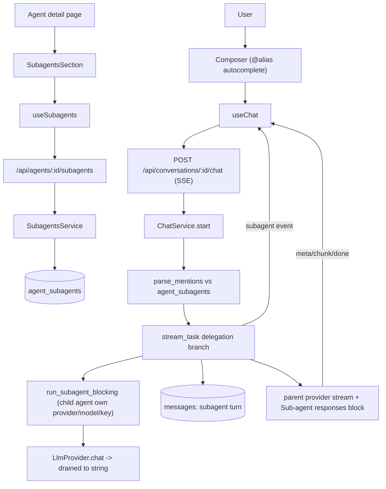

# F11. Sub-agents — Technical Specification

## Section 1: Technical Overview

**What:** Add agent-to-agent delegation. Any agent (the *parent*) can attach other
existing agents (its *sub-agents*) through a new ordered many-to-many relation
`agent_subagents`, each carrying an `@handle` alias and an optional "when to use"
description. During a chat turn the user explicitly routes work to a sub-agent by
typing `@alias` in the message. Each mention triggers a real, separate LLM call
dispatched with the child agent's own persona, provider, model, and key; the child's
reply is persisted as a distinct, labeled turn and streamed to the client, after which
the parent agent runs its normal turn with the sub-agent replies supplied as context
and synthesizes the final answer.

**Why:** The codebase already has every building block: a proven ordered M:N
attachment domain (`skill_attachments` / `agent_skills`, F04), a multi-provider
streaming `LlmProvider` abstraction (F07), and a per-conversation chat runtime that
composes a system prompt and spawns a streaming task. Sub-agents reuse all three. The
only genuinely new mechanics are (a) a second attachment table + domain module, (b) a
deterministic `@mention` parser, and (c) a delegation pre-phase inside the chat stream
task that drains a child's streaming call to a string before the parent streams. No
tool-calling / function-calling is introduced — the provider abstraction stays
streaming-only.

**Scope — Included:**
- `agent_subagents` ordered M:N relation (parent → child) with alias + description; a
  new `subagents` backend domain (`model.rs` / `service.rs` / `mod.rs`) and
  `routes/subagents.rs`, mirroring `skill_attachments`.
- Attach / list / update (alias + description) / reorder / detach endpoints, plus
  attach-time validation: alias format & uniqueness, `0..=10` cap, self-attach
  rejection, and cycle detection over the agent→sub-agent graph.
- Two new nullable columns on `messages` (`subagent_alias`, `subagent_agent_id`) to mark
  a delegated turn; no `role` CHECK change (delegated turns are `role = 'assistant'`).
- `@mention` parsing in the chat runtime (strip matched handles for the child task),
  a blocking child-call helper, a new `subagent` SSE event, and a parent-prompt
  "Sub-agent responses" context block.
- Caps & safety: up to 3 distinct mentions honored per turn (extras ignored with a
  notice); runtime delegation depth limited to 2 (a delegated child does not itself
  parse `@mentions` in v1).
- Frontend: a "Sub-agents" section on the agent detail page parallel to the F04 Skills
  section (attach-existing picker + **"New sub-agent"** quick-create + drag reorder +
  detach); `@`-autocomplete in the chat composer; a labeled sub-agent bubble in the
  message list; live handling of the `subagent` SSE event. All strings localized in
  `en` and `pt-BR`.

**Scope — Excluded:**
- Autonomous routing (the model deciding to delegate) via tool-calling / function-calling.
- A child reading or writing the parent conversation's memory/history (delegation is
  stateless — the child receives only the task text), and the child running its own F08
  recall.
- Nested delegation beyond depth 1 at runtime (the depth-2 constant is a guardrail).
- A distinct "sub-agent" entity type — a sub-agent is always a normal agent.

## Section 2: Architecture Impact

**Affected components:**

- **Backend (new):** `backend/src/subagents/{model.rs,service.rs,mod.rs}`,
  `backend/src/routes/subagents.rs`, `backend/migrations/0007_subagents.sql`.
- **Backend (modified):** `backend/src/lib.rs` / `main.rs` (module + wiring),
  `backend/src/routes/mod.rs` (`AppState.subagents`, merge routes),
  `backend/src/chat/{service.rs,model.rs,compose.rs}` (delegation pre-phase, mention
  parsing, `Subagent` stream event, parent context block),
  `backend/src/conversations/{model.rs,service.rs}` (carry + persist the two new message
  columns).
- **Frontend (new):** `src/hooks/useSubagents.ts`,
  `src/pages/Agents/SubagentsSection.tsx`, `src/pages/Agents/SubagentPicker.tsx`.
- **Frontend (modified):** `src/lib/api.ts` (types + methods + `subagent` SSE event),
  `src/hooks/useChat.ts` (handle `subagent` event), `src/pages/Chat/Composer.tsx`
  (`@`-autocomplete), `src/pages/Chat/MessageBubble.tsx` (+ `MessageList.tsx`) (labeled
  variant), the agent detail page (mount the section),
  `src/i18n/locales/{en,pt-BR}.json`.



## Section 3: Technical Decisions

| Decision | Chosen Approach | Alternative Considered | Trade-off |
|----------|-----------------|------------------------|-----------|
| Sub-agent entity | A sub-agent IS a normal agent, linked via `agent_subagents`; reuse F02/F04 | A distinct lightweight entity type | Child agents appear in the main list and are independently chattable; we accept that in exchange for zero new entity/CRUD surface |
| Delegated-turn persistence | `role = 'assistant'` + nullable `subagent_alias` / `subagent_agent_id` columns | New `'subagent'` role in the CHECK constraint | No CHECK change and no churn in role-matching code; a non-null alias is the discriminator |
| Delegation execution & transport | Run child calls inside the spawned `stream_task`; emit one `subagent` SSE event per child as it completes, then stream the parent reply | Blocking in `start()` preflight, carried on the `Meta` frame | Most responsive (each labeled bubble lands as produced); parent provider errors become stream `Error` frames on the delegated path (the task already handles mid-stream errors) |
| Trigger | Deterministic `@alias` regex match against the parent's attached aliases | Router pre-call / tool-calling | Zero extra LLM cost and fully predictable; the user must explicitly mention to delegate |
| Child memory | Stateless — task = user message with matched handles stripped; no parent memory R/W, no child F08 recall | Child gets its own conversation/memory | Simpler and cheaper; a reviewer-style child needs no history. We accept that children cannot "remember" across turns |
| Safety model | Cycle + self-attach rejected at attach time (DFS over the graph); runtime depth capped at 2; ≤3 mentions/turn | Runtime-only guard | Bad configurations are blocked early at the source; the runtime cap is a cheap backstop |
| Mention cap overflow | Honor first 3 distinct matched aliases in order; ignore extras with an inline notice | Hard-error the turn | Keeps the turn usable; bounds worst-case cost/latency to 3 child calls |

## Section 4: Component Overview

**Backend:**

| File Path | New/Modified | Purpose | Key Responsibilities |
|-----------|--------------|---------|----------------------|
| `backend/src/subagents/model.rs` | New | Types/rows | `AgentSubagent` row, `AttachedSubagent` (joined view), `AttachInput`, `UpdateInput`, `ReorderInput`, `Warning`, alias constants |
| `backend/src/subagents/service.rs` | New | Business logic | list/attach/update/reorder/detach; alias + cap validation; cycle/self-attach detection; position renumber |
| `backend/src/subagents/mod.rs` | New | Wiring | Re-export `SubagentsService`; module glue |
| `backend/src/routes/subagents.rs` | New | HTTP | `GET/POST/PUT/DELETE` under `/api/agents/{agent_id}/subagents` |
| `backend/migrations/0007_subagents.sql` | New | Schema | `agent_subagents` table + indexes/constraints; two `messages` columns |
| `backend/src/routes/mod.rs` | Modified | App wiring | `AppState.subagents`; merge `subagents::routes()` into protected router |
| `backend/src/chat/service.rs` | Modified | Delegation runtime | `parse_mentions`, `run_subagent_blocking`, delegation branch in `stream_task`, parent context block, inject `SubagentsService` |
| `backend/src/chat/model.rs` | Modified | SSE | New `StreamEvent::Subagent { … }` variant |
| `backend/src/chat/compose.rs` | Modified | Prompt | Append "Sub-agent responses" block to `base_system` |
| `backend/src/conversations/model.rs` | Modified | Message row | Add `subagent_alias`, `subagent_agent_id` to `Message` + `NewMessage::subagent(...)` |
| `backend/src/conversations/service.rs` | Modified | Persistence | Select + insert the two new columns |
| `backend/src/main.rs` (or `lib.rs`) | Modified | Bootstrap | Construct `SubagentsService`; pass into `ChatService` + `AppState` |

**Frontend:**

| File Path | New/Modified | Purpose | Key Responsibilities |
|-----------|--------------|---------|----------------------|
| `src/hooks/useSubagents.ts` | New | Data hooks | `useAttachedSubagents`, `useAttachSubagent`, `useUpdateSubagent`, `useReorderSubagents`, `useDetachSubagent` |
| `src/pages/Agents/SubagentsSection.tsx` | New | UI | List attached sub-agents (alias, child name, hint), drag reorder, detach, open picker, "New sub-agent" |
| `src/pages/Agents/SubagentPicker.tsx` | New | UI | Modal listing other agents (search, select); disable self/cycle; alias + description fields on attach |
| `src/lib/api.ts` | Modified | Client | Subagent types + CRUD methods; add `subagent` to the chat SSE event union; new `Message` fields |
| `src/hooks/useSubagents helpers` (in api) | Modified | Client | `listSubagents/attachSubagent/updateSubagent/reorderSubagents/detachSubagent` |
| `src/hooks/useChat.ts` | Modified | Chat | Accumulate `subagent` events into labeled bubbles rendered before the parent draft |
| `src/pages/Chat/Composer.tsx` | Modified | Chat input | `@`-autocomplete from the agent's attached aliases |
| `src/pages/Chat/MessageBubble.tsx` | Modified | Chat output | Labeled sub-agent variant when `subagent_alias` is set |
| `src/pages/Chat/MessageList.tsx` | Modified | Chat output | Render live sub-agent draft bubbles |
| `src/pages/Agents/<AgentDetail>.tsx` | Modified | Wiring | Mount `SubagentsSection`; chip showing consult count is in the bubble |
| `src/i18n/locales/en.json` / `pt-BR.json` | Modified | i18n | All new labels, picker text, tooltips, notices |

**Database:**

| Migration File | Tables Affected | Operation | Notes |
|----------------|-----------------|-----------|-------|
| `0007_subagents.sql` | `agent_subagents` | CREATE | Ordered M:N parent→child + alias/description |
| `0007_subagents.sql` | `messages` | ALTER | Add `subagent_alias`, `subagent_agent_id` (both nullable) |

## Section 5: API Contracts

All endpoints sit under the F10 `require_auth` layer (Bearer JWT) and follow the
existing `AppError` JSON error envelope. Base path: `/api/agents/{agent_id}/subagents`
where `{agent_id}` is the parent.

### Endpoint: List attached sub-agents
- **Method:** GET · **Path:** `/api/agents/{agent_id}/subagents` · **Auth:** Bearer

**Response (200):**

| Field | Type | Description |
|-------|------|-------------|
| `attached[].child_id` | `uuid` | The child agent's id |
| `attached[].name` | `string` | Child agent name |
| `attached[].alias` | `string` | `@handle` (without the `@`) |
| `attached[].description` | `string?` | Optional "when to use" hint |
| `attached[].position` | `integer` | 0-based order |

```json
{ "attached": [
  { "child_id": "…", "name": "Code Reviewer", "alias": "code-reviewer",
    "description": "Use for code review and bug hunting", "position": 0 }
] }
```

### Endpoint: Attach a sub-agent
- **Method:** POST · **Path:** `/api/agents/{agent_id}/subagents` · **Auth:** Bearer

**Request:**

| Field | Type | Required | Validation | Description |
|-------|------|----------|------------|-------------|
| `child_id` | `uuid` | Yes | exists; `≠ agent_id`; no cycle; parent has `<10` attached | Agent to attach |
| `alias` | `string` | No | `^[a-z0-9-]{1,30}$`; unique within parent | Defaults to a slug of the child name |
| `description` | `string` | No | `≤ 200` chars | "When to use" hint |

```json
{ "child_id": "660e…", "alias": "code-reviewer", "description": "Use for code review" }
```

**Response (201):** the created `AttachedSubagent` row (same shape as a list item) under `attached`.

**Error codes:**

| Code | HTTP | Description |
|------|------|-------------|
| validation `child_id` | 422 | Self-attach, unknown agent, would create a cycle, or cap exceeded |
| validation `alias` | 422 | Bad format or duplicate within the parent |

### Endpoint: Update a sub-agent attachment (alias / description)
- **Method:** PUT · **Path:** `/api/agents/{agent_id}/subagents/{child_id}` · **Auth:** Bearer

**Request:** `{ "alias": "reviewer", "description": "…" }` (either field optional; alias re-validated for format + uniqueness).
**Response (200):** updated `AttachedSubagent`. **404** if not attached.

### Endpoint: Reorder sub-agents
- **Method:** PUT · **Path:** `/api/agents/{agent_id}/subagents` · **Auth:** Bearer

**Request:**

| Field | Type | Required | Validation | Description |
|-------|------|----------|------------|-------------|
| `ordered_child_ids` | `uuid[]` | Yes | a permutation of the currently attached child ids | New order |

```json
{ "ordered_child_ids": ["660e…", "771f…"] }
```

**Response (200):** the re-ordered `attached` list. **422** if the set doesn't match the attached ids.

### Endpoint: Detach a sub-agent
- **Method:** DELETE · **Path:** `/api/agents/{agent_id}/subagents/{child_id}` · **Auth:** Bearer
- **Response (204).** **404** if not attached. (Detach leaves both agents intact; positions renumbered to close the gap, as in F04.)

### Chat SSE — new `subagent` event
Emitted on `POST /api/conversations/{id}/chat` (existing endpoint) once per honored
mention, before the parent's `meta`/`chunk` frames.

| Field | Type | Description |
|-------|------|-------------|
| `type` | `string` | Always `"subagent"` |
| `message_id` | `uuid` | The persisted sub-agent turn id |
| `alias` | `string` | `@handle` used |
| `agent_id` | `uuid` | Child agent id |
| `agent_name` | `string` | Child agent name (label) |
| `content` | `string` | Full child reply (drained from the child stream) |
| `status` | `string` | `"complete"` or `"error"` |
| `error` | `string?` | Present when `status = "error"` |

```json
{ "type": "subagent", "message_id": "…", "alias": "code-reviewer",
  "agent_id": "…", "agent_name": "Code Reviewer",
  "content": "Found a null-deref on line 4…", "status": "complete" }
```

**Quick-create note (no new endpoint):** the "New sub-agent" flow uses the existing
`POST /api/agents` to create the child, then `POST …/subagents` to attach it.

## Section 6: Data Model

**Table: `agent_subagents`**

| Column | Type | Nullable | Default | Description |
|--------|------|----------|---------|-------------|
| `parent_id` | `uuid` | No | - | Parent agent (FK → agents, ON DELETE CASCADE) |
| `child_id` | `uuid` | No | - | Sub-agent (FK → agents, ON DELETE CASCADE) |
| `alias` | `text` | No | - | `@handle`, `^[a-z0-9-]{1,30}$`, unique per parent |
| `description` | `text` | Yes | - | Optional "when to use" hint (≤ 200 chars, app-enforced) |
| `position` | `smallint` | No | - | 0-based order, `BETWEEN 0 AND 9` |
| `created_at` | `timestamptz` | No | `now()` | Creation time |

**Indexes:**

| Index Name | Columns | Type | Purpose |
|------------|---------|------|---------|
| `pk_agent_subagents` | `(parent_id, child_id)` | btree (PK) | One link per pair |
| `uq_agent_subagents_pos` | `(parent_id, position)` | unique | Stable ordering |
| `uq_agent_subagents_alias` | `(parent_id, alias)` | unique | Alias unique per parent |
| `idx_agent_subagents_child` | `(child_id)` | btree | Reverse lookups / cascade |

**Constraints:**

| Constraint | Type | Definition | Purpose |
|------------|------|------------|---------|
| `pk_agent_subagents` | PRIMARY KEY | `(parent_id, child_id)` | Identity |
| `fk_parent` | FOREIGN KEY | `parent_id → agents(id) ON DELETE CASCADE` | Cleanup with parent |
| `fk_child` | FOREIGN KEY | `child_id → agents(id) ON DELETE CASCADE` | Cleanup with child |
| `ck_not_self` | CHECK | `parent_id <> child_id` | DB-level self-attach guard |
| `ck_position` | CHECK | `position BETWEEN 0 AND 9` | Max 10 sub-agents |

> Cycle detection (beyond direct self-attach) is enforced in the service layer via a DFS
> over existing parent→child edges — SQL cannot express it cheaply.

**Table: `messages` (ALTER — add two nullable columns)**

| Column | Type | Nullable | Default | Description |
|--------|------|----------|---------|-------------|
| `subagent_alias` | `text` | Yes | `NULL` | Non-null marks a delegated turn; the label shown |
| `subagent_agent_id` | `uuid` | Yes | `NULL` | Child agent (FK → agents, ON DELETE SET NULL) — keeps history if the child is later deleted |

**Migration (`0007_subagents.sql`):**
```sql
-- F11 sub-agents: agent → agent delegation links + delegated-turn marking.

CREATE TABLE agent_subagents (
    parent_id   UUID NOT NULL REFERENCES agents (id) ON DELETE CASCADE,
    child_id    UUID NOT NULL REFERENCES agents (id) ON DELETE CASCADE,
    alias       TEXT NOT NULL,
    description TEXT,
    position    SMALLINT NOT NULL CHECK (position BETWEEN 0 AND 9),
    created_at  TIMESTAMPTZ NOT NULL DEFAULT now(),
    PRIMARY KEY (parent_id, child_id),
    UNIQUE (parent_id, position),
    UNIQUE (parent_id, alias),
    CHECK (parent_id <> child_id)
);
CREATE INDEX idx_agent_subagents_child ON agent_subagents (child_id);

ALTER TABLE messages
    ADD COLUMN subagent_alias    TEXT,
    ADD COLUMN subagent_agent_id UUID REFERENCES agents (id) ON DELETE SET NULL;
```

**Runtime data flow (chat turn with mentions):**
1. `ChatService::start` resolves the parent agent + user message, then loads the parent's
   attached sub-agents and runs `parse_mentions(user_text, &attached)` →
   `(matched: Vec<MatchedSub>, child_task: String, overflow_notice: bool)`.
   `matched` is de-duplicated, first-occurrence ordered, capped at 3; `child_task` is the
   user text with matched `@handles` removed; unmatched handles stay as literal text.
2. Memory block + `base_system` are computed as today (for the parent). The spawned
   `stream_task` receives `matched` + `child_task`.
3. **Delegation branch** (only when `matched` is non-empty): for each matched sub-agent,
   `run_subagent_blocking` composes the child's own system prompt
   (`AttachmentsService::compose(child_id)` + F09 language directive), builds a
   `ChatRequest` whose `messages = [user(child_task)]`, resolves the child's own
   key/base_url, calls `provider.chat`, and **drains the stream to a String**. The reply
   is persisted via `NewMessage::subagent(content, status, model, alias, child_id)` and a
   `StreamEvent::Subagent` is emitted. On child error a `status = "error"` turn is
   persisted + emitted, an `Error` frame is sent, and the parent turn is **not** run.
4. The parent `base_system` is augmented with a **Sub-agent responses** block built from
   the successful replies, then `compose(...)` applies the existing budget reduction. The
   parent provider stream opens and `meta`/`chunk`/`done` proceed exactly as today; the
   parent's own user turn keeps the original (un-stripped) text.

**Parent context block (appended to `base_system`):**
```
# Sub-agent responses
You delegated parts of this turn to your sub-agents. Their replies follow; use them to
inform your answer.

## @code-reviewer (Code Reviewer)
<full child reply>
```

## Section 7: Testing Strategy

**Test files:**

| Test File | Test Type | Target | Coverage Goal |
|-----------|-----------|--------|---------------|
| `backend/src/subagents/service.rs` (`#[cfg(test)]`) | Unit | validation, cycle, reorder | 90% of service logic |
| `backend/src/chat/service.rs` (`#[cfg(test)]`) | Unit | `parse_mentions`, context block | 90% of parsing |
| `backend/tests/subagents.rs` | Integration | CRUD endpoints | attach/list/update/reorder/detach |
| `backend/tests/chat_delegation.rs` | Integration | delegation over SSE | mention → subagent event + persisted turn + parent turn |
| `frontend/src/hooks/useSubagents.test.ts(x)` | Unit | data hooks | attach/detach/reorder cache updates |
| `frontend/src/pages/Agents/SubagentsSection.test.tsx` | Component | section UI | list/attach/detach render |
| `frontend/src/pages/Chat/Composer.test.tsx` | Component | `@`-autocomplete | suggestions filter by attached alias |
| `frontend/src/pages/Chat/MessageBubble.test.tsx` | Component | labeled variant | renders alias label when set |
| `frontend/src/hooks/useChat.test.ts` | Unit | SSE handling | `subagent` event → labeled bubble |

**Backend unit — `subagents::service`:**

| Test Function | Description | Assertions |
|---------------|-------------|------------|
| `rejects_self_attach` | `child_id == parent_id` | `Validation` error, no row |
| `rejects_more_than_ten` | 11th attach | `Validation` error |
| `rejects_cycle` | A→B exists, attach B→A | `Validation` error (cycle) |
| `accepts_dag_diamond` | A→B, A→C, B→C (no cycle) | all succeed |
| `rejects_bad_alias` | `@Bad Alias` / 31 chars | `Validation` on `alias` |
| `rejects_duplicate_alias` | same alias twice on one parent | `Validation` on `alias` |
| `default_alias_from_name` | omit alias | slug of child name persisted |
| `reorder_renumbers_positions` | reorder 3 | positions 0,1,2 in new order |
| `detach_closes_gap` | detach middle | remaining renumbered contiguously |

**Backend unit — `chat::service` mention parsing:**

| Test Function | Description | Assertions |
|---------------|-------------|------------|
| `parses_single_mention` | `@code-reviewer hi` | one match; task = `hi` |
| `dedupes_and_orders` | `@a @b @a` | `[a, b]`, first-occurrence order |
| `caps_at_three` | 4 distinct mentions | first 3 matched, overflow flag true |
| `ignores_unmatched` | `@nope hi` (not attached) | no match; task keeps `@nope hi`; literal preserved |
| `strips_only_matched` | `@a @nope x` | task = `@nope x` |
| `appends_context_block` | 2 replies | block lists both with alias + name |

**Backend integration:**

| Test Function | Description | Assertions |
|---------------|-------------|------------|
| `attach_list_detach_roundtrip` | POST→GET→DELETE | 201/200/204; list reflects state |
| `attach_rejects_cycle_http` | create cycle via API | 422 with `child_id` error |
| `reorder_persists` | PUT order | GET returns new order |
| `delegation_emits_subagent_and_parent` | chat with `@alias` (stub provider) | `subagent` frame present; a `subagent_alias` message row exists; parent `assistant` turn follows; parent prompt contained the responses block |
| `delegation_child_error_holds_parent` | child provider errors | sub-agent turn `status=error`; no parent assistant turn; `Error` frame sent |
| `unmatched_mention_completes_normally` | `@nope` only | no `subagent` frame; normal parent turn |

**Frontend:**

| Test Function | Description | Assertions |
|---------------|-------------|------------|
| `useSubagents_attach_updates_cache` | attach mutation | query invalidated; item present |
| `section_renders_and_detaches` | render + detach click | row removed, mutation called |
| `picker_disables_self_and_cycle` | open picker | parent + cycle-forming agents disabled |
| `composer_autocompletes_alias` | type `@co` | suggests `code-reviewer` |
| `bubble_renders_subagent_label` | message with alias | label "Code Reviewer" shown |
| `useChat_handles_subagent_event` | feed SSE `subagent` | labeled draft bubble appears before parent |

**Acceptance tests (PRD §9 F11 → mapped):** each F11 acceptance criterion maps to one of
the above (attach/list/cap/cycle/self → service + integration; `@mention` invokes child
with own model → `delegation_emits_subagent_and_parent`; distinct labeled turn →
`bubble_renders_subagent_label` + integration row; parent synthesizes with reply as
context → `appends_context_block` + integration; multi-mention cap 3 → `caps_at_three`;
unmatched handle → `unmatched_mention_completes_normally`; stateless (no parent memory
R/W) → assert the child `ChatRequest.messages` is exactly `[user(task)]` and no embedding
is written for the child call; child failure holds parent → `delegation_child_error_holds_parent`;
reorder/alias/detach persist → `reorder_persists` + roundtrip; i18n → both catalogs have
all new keys, asserted by the existing i18n key-parity test if present).

**Cross-feature integration tests (PRD §9 → mapped):**

| Criterion | Test |
|-----------|------|
| Sub-agent dispatches with child's F02 provider/model/key | `delegation_emits_subagent_and_parent` asserts the child `ChatRequest.model` == child agent model and the child key path is used |
| F11 reuses F04 ordered M:N and respects order | `reorder_persists` + delegation invokes in attachment/mention order |
| Delegated turn streams the parent reply through F07 with the reply as context | `delegation_emits_subagent_and_parent` asserts the parent `system` contains the responses block and `chunk`/`done` frames follow |

## Section 8: Assumptions & Decisions

- **Sub-agent = normal agent** (no new entity). "New sub-agent" quick-create reuses
  `POST /api/agents` then `POST …/subagents`; no dedicated endpoint. *(PRD Experience.)*
- **Delegated-turn persistence:** `role = 'assistant'` + nullable `subagent_alias` /
  `subagent_agent_id`; non-null alias is the discriminator. *(User decision.)*
- **Delegation transport:** in-stream `subagent` SSE events emitted from `stream_task`,
  then the parent streams. Parent provider errors on the delegated path surface as SSE
  `Error` frames rather than HTTP preflight. *(User decision.)*
- **Child task text:** the user message with **matched** handles stripped; unmatched
  handles remain literal. The parent's own user turn retains the original text. *(PRD.)*
- **Stateless child:** child `ChatRequest.messages = [user(task)]`; no parent memory read
  or write; the child call does not enqueue F08 embeddings. The sub-agent's *output* turn
  is persisted in the parent conversation and is eligible for the parent's normal F08
  embedding like any assistant turn. *(PRD + inference; flagged for review.)*
- **Caps:** ≤10 sub-agents/parent (`position 0..=9`); ≤3 honored mentions/turn (extras →
  notice); runtime delegation depth = 2 (the child does not parse `@mentions` in v1, so
  effective runtime depth is 1). *(PRD.)*
- **Alias:** `^[a-z0-9-]{1,30}$`, unique per parent, defaults to a kebab slug of the child
  agent's name on attach. Matching is case-insensitive on input (handles lowercased before
  comparison). *(Inference from `@handle` rule.)*
- **Description length:** ≤200 chars, app-validated (mirrors F03 skill `description`).
  *(Inference; flagged.)*
- **Endpoint shape:** per-item POST/PUT/DELETE + root PUT reorder (instead of F04's
  single replace-all), because each attachment carries its own alias/description and the
  quick-create flow attaches one at a time. *(Inference from F04 + Experience.)*
- **`subagent_agent_id` is `ON DELETE SET NULL`** so deleting a child agent preserves the
  historical labeled turn (the alias text remains). The `agent_subagents` link itself is
  `ON DELETE CASCADE`. *(Inference.)*

**PRD traceability:** Capabilities → Section 5 (API) + Section 6 (Data Model) + business
rules in Section 6 runtime flow. Experience → Section 4 (frontend components) + Section 6
flow. Error Handling → Section 5 error codes + Section 6 child-error path. §9 acceptance
& Cross-Feature Integration → Section 7. Consumes (F02/F04/F07) → Sections 2–6.
