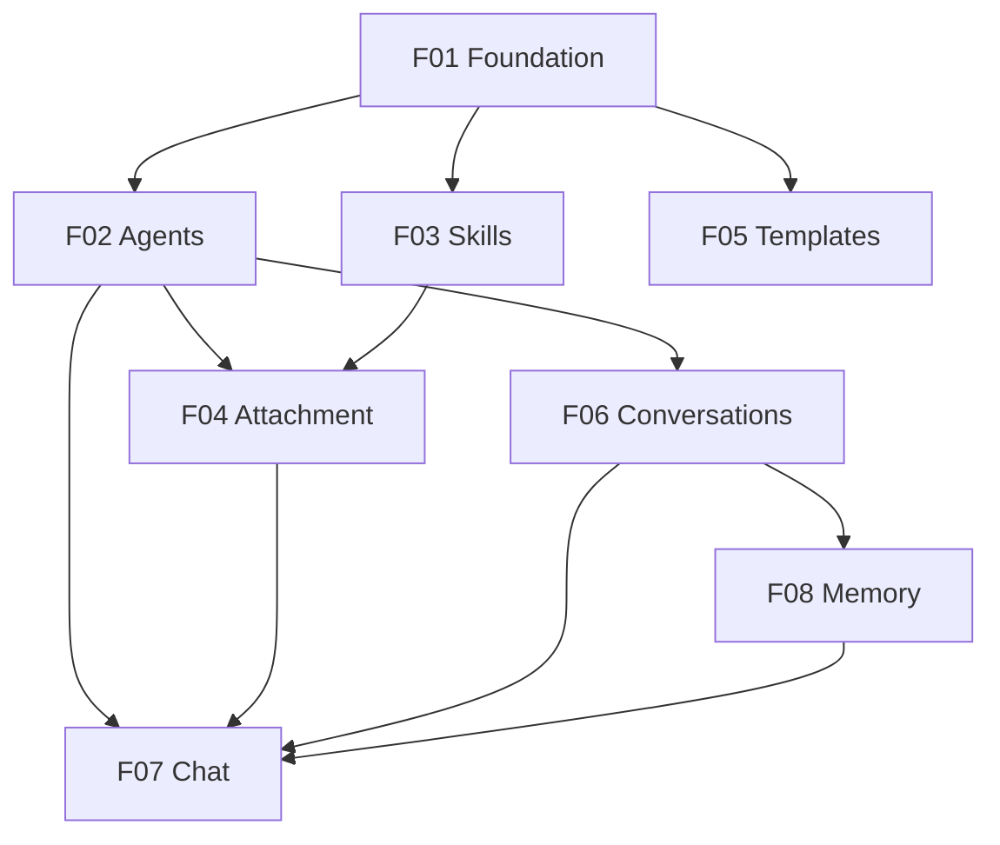

# agent-maker

## 1. Executive Summary

agent-maker is a local-first web application that lets anyone build, customize, and chat with their own AI agents — without writing code. Each agent is a persona defined by a name, a preamble, and a system prompt, and lives in its own dedicated chat surface. Reusable Skills — small instruction bundles with a name, description, and body — can be attached to any number of agents, snapping in like LEGO blocks to extend behavior across a user's whole agent roster.

The product is aimed at non-technical knowledge workers who want sophisticated, persistent AI teammates tailored to their workflows, while still exposing advanced controls (raw prompt editing, model selection, per-agent API keys) for power users who want full control. It works against multiple LLM providers (Anthropic, OpenAI, and local models such as Ollama) through a single abstraction, so the user picks the engine that fits each agent.

To make agents feel coherent over weeks and months of use, agent-maker pairs every agent with a memory system that combines the most recent conversation turns with semantic retrieval of older relevant turns. The result is an "operating system for personal AI": a single workspace where users assemble a long-lasting team of specialized AI collaborators.

## 2. Problem and Opportunity

### The Problem

**Generic chatbots forget who you are and what you do**
- Users repeat the same context (role, project, preferences, tone) in every new conversation
- There is no persistent "persona" tied to a specific workflow — each chat starts from zero
- Long conversations lose coherence as context windows fill, with no way to recover relevant earlier turns

**Building custom AI requires engineering skills**
- Off-the-shelf tools that allow real customization (system prompts, tool use, memory) target developers and assume API/SDK familiarity
- Non-engineers cannot compose reusable instructions across multiple assistants — every "custom GPT" is a one-off they cannot extend or share between use cases
- Switching LLM providers (price, speed, privacy) typically means rebuilding from scratch

**No single workspace for a team of personal AIs**
- Users juggle multiple chat tools (one per provider, one per use case) and lose history when they switch
- There is no way to organize, clone, and iterate on agents over time
- Pre-made templates are scattered across forums and prompt libraries instead of being one click away

### The Opportunity

agent-maker turns the LEGO metaphor into a real product. Personas (Agents) and reusable instruction bundles (Skills) are first-class objects users compose, clone, and re-attach. A memory system gives every agent durable coherence: short-term verbatim recall plus semantic retrieval of older turns. A multi-provider abstraction lets users pick the engine per agent without losing their work. A starter template library means non-engineers get value the moment they open the app.

## 3. Target Audience

### Primary Users

**The Knowledge Worker**
- Professional (consultant, writer, marketer, researcher, PM) with repeatable workflows but no coding background
- Wants 3–10 specialized AI helpers (a "writing editor", a "meeting prep coach", a "research assistant") rather than one generic chatbot
- Values simple UI, ready-made templates, and conversations that remember context across weeks

**The AI Power User**
- Developer, AI tinkerer, or technical professional who wants control over prompts, model choice, and skill composition
- Wants to experiment with prompt structures, mix providers per agent, and reuse instruction bundles across agents
- Comfortable editing raw prompt text and managing their own API keys

### Behavioral Profile

- Uses LLMs daily or near-daily and has hit the limits of generic chat tools
- Cares about privacy and cost — prefers running locally and supplying their own API keys (BYOK)
- Iterates on prompts over time and wants their refinements to compound rather than getting lost
- Expects modern web-app UX: fast, streaming responses, keyboard-friendly, no setup ceremony

## 4. Objectives

### Product Objectives

- **Enable** non-engineers to create a working custom agent end-to-end in under 5 minutes from first launch
- **Compose** behavior through reusable skills, so a single skill update propagates to every agent that uses it
- **Sustain** coherent multi-week conversations through a memory system that combines recent turns with semantic retrieval
- **Abstract** away LLM provider differences so users can pick or switch engines per agent without losing data
- **Activate** users by shipping a starter library that demonstrates value before any custom configuration

### Success Metrics

- Time from first launch to first working agent conversation: ≤ 5 minutes for 80% of new users
- Users with ≥ 3 agents created within their first 7 days of use: ≥ 50% (primary activation metric)
- Skills reused across multiple agents: ≥ 30% of created skills attached to 2+ agents
- Median conversation length sustained without coherence breakdown: ≥ 50 turns (measured by user-reported continuity surveys or session-length proxy)
- Weekly active users (week-over-week retention after week 4): ≥ 35%
- Users adopting at least one starter template in their first session: ≥ 60%

## 5. User Stories

### F01. App Foundation and Settings
- As a user, I want to open the app in my browser and see it ready to use without account creation, so that I can start immediately
- As a user, I want to configure default LLM providers and paste my API keys in a settings page, so that all new agents work without per-agent setup
- As a user, I want my agents, skills, and chats persisted locally between sessions, so that I never lose my work
- As a power user, I want to choose between multiple installed LLM providers (Anthropic, OpenAI, local), so that I can pick the right engine for each agent

### F02. Agent Management
- As a user, I want to create an agent by entering a name, preamble, and system prompt, so that I can define a custom persona
- As a user, I want to edit an existing agent's fields, so that I can iterate on the persona over time
- As a user, I want to clone an agent, so that I can quickly create a variant without rewriting it
- As a user, I want to delete an agent, so that I can keep my workspace tidy
- As a power user, I want to choose the provider, model, and (optionally) an API key on a per-agent basis, so that I can mix engines across agents

### F03. Skill Management
- As a user, I want to create a skill with a name, description, and instruction body, so that I can package reusable behavior
- As a user, I want to edit a skill and have changes reflect immediately in every agent that uses it, so that improvements compound
- As a user, I want to clone a skill, so that I can build a variant without losing the original
- As a user, I want to delete a skill, with a clear warning when it's attached to agents, so that I don't break those agents by accident

### F04. Skill Attachment to Agents
- As a user, I want to attach one or more skills to an agent from a skills picker, so that the agent gains that extra behavior
- As a user, I want to detach a skill from an agent, so that I can simplify the persona
- As a user, I want to reorder the attached skills, so that I control the order they appear in the system prompt
- As a user, I want to see, on each skill, which agents currently use it, so that I understand its reach

### F05. Starter Template Library
- As a new user, I want to browse a built-in library of pre-made agents and skills, so that I see real examples instead of an empty workspace
- As a user, I want to adopt a template into my workspace with one click, producing an editable copy, so that I can customize it without affecting the original
- As a user, I want to filter templates by category (writing, research, productivity, coding, etc.), so that I find relevant starters quickly

### F06. Conversation Management
- As a user, I want each agent to support multiple independent conversation threads, so that I can separate distinct projects or topics
- As a user, I want to start a new conversation, switch between conversations, and rename or delete them, so that I can organize my work
- As a user, I want conversation history fully persisted between sessions, so that I can pick up where I left off
- As a user, I want a visible list of conversations per agent showing title and last-activity time, so that I can navigate quickly

### F07. Chat Runtime
- As a user, I want to send messages and see the agent's reply stream in token-by-token, so that the experience feels responsive
- As a user, I want the agent's persona, attached skills, and relevant memory automatically composed into each request, so that I never have to repeat context
- As a user, I want to stop a streaming response in progress, so that I can abandon a bad answer quickly
- As a user, I want to see a clear error if the LLM provider call fails, with the option to retry, so that transient failures don't lose my message

### F08. Memory System
- As the system, I want to keep the last N turns of each conversation verbatim in the prompt, so that immediate context is always preserved
- As the system, I want to embed older turns and retrieve the top-K most semantically relevant ones for each new user message, so that long-running conversations stay coherent
- As a user, I want to see which earlier turns the agent recalled for the current message (a "what I remembered" indicator), so that I trust and understand the memory system
- As a user, I want the option to clear an agent's long-term memory for a conversation, so that I can reset context when needed

## 6. Functionalities

### F01. App Foundation and Settings

**Provides:**
- Local persistence layer (PostgreSQL with pgvector extension, started via docker-compose) and configured LLM provider clients with default API keys (used by F02, F03, F04, F05, F06, F07, F08)

**Capabilities:**
- Single-user, local-only web application — backend bound to localhost; no authentication
- Settings page exposing: default provider selection (Anthropic, OpenAI, local/Ollama-compatible), per-provider API key inputs (paste, mask, save), default model per provider, and a "test connection" button per provider
- API keys stored locally and encrypted at rest using OS-level keychain when available, falling back to an app-level encrypted store
- PostgreSQL database (with the `pgvector` extension enabled) provisioned via a bundled `docker-compose.yml` and initialized on first run with schema for agents, skills, agent_skill links, conversations, messages, and message embeddings (using a `vector` column type)
- Database connection string is configurable in settings (defaults match the bundled docker-compose service: host `localhost`, port `5432`, db `agentmaker`, user `agentmaker`)
- Bundled `docker-compose.yml` defines a single `postgres` service using an official `pgvector/pgvector` image, with a named volume for durable local storage and a healthcheck the app waits on at startup
- App documents and exposes `docker compose up -d` (and `down`) as the canonical way to start/stop the database; the app refuses to start until the database is reachable and shows a clear remediation message otherwise
- Supported providers in v1: Anthropic (Claude family), OpenAI (GPT family), local OpenAI-compatible endpoint (Ollama, LM Studio)
- Multi-provider abstraction layer presenting a unified `chat(model, messages, stream)` interface
- Global app-level settings: theme (light/dark/system), default memory parameters (recent-N, top-K) with sensible defaults of N=10, K=5

**Experience:**
- First launch shows a one-screen onboarding: "Add at least one provider key to start" with quick links to each provider's key-creation page
- Settings page is reachable from a persistent left navigation; sections are: Providers, Memory Defaults, Appearance, Data (export/wipe local data)
- Pasted API keys are masked by default; "show" toggles reveal them; "test connection" returns a green check or a specific error
- All changes save automatically with a subtle toast confirmation

**Error Handling:**
- Database init fails: app shows a blocking error screen with the local DB path and a "retry" button
- API key test fails: inline error states the provider, the HTTP status, and a one-line remediation hint
- Encrypted key store unavailable: app falls back to an app-level encrypted store and warns the user once
- Settings save fails: toast surfaces the failure and the form remains dirty so changes aren't silently lost

### F02. Agent Management

**Consumes:**
- F01: configured LLM provider clients and default keys

**Provides:**
- Agent definitions including name, preamble, system prompt, provider, model, optional per-agent key (used by F04, F06, F07)

**Capabilities:**
- Fields per agent: name (1–60 chars, required, unique within workspace), preamble (≤ 500 chars, optional — short description shown in lists), system prompt (≤ 20,000 chars, required), provider (required, from F01), model (required, dynamic list per provider), per-agent API key (optional override of provider default)
- CRUD: create, read, list, update, delete
- Clone: produces a copy with name suffixed " (copy)"; user can immediately rename
- Soft validation: warn (do not block) if system prompt is shorter than 50 chars or longer than 10,000 chars
- Agent list view sortable by name, last-used, and created date

**Experience:**
- Agents list in left navigation with search box and "+ New Agent" button
- Create/edit form is a single page: name and preamble at the top, large editable textarea for system prompt, provider/model dropdowns, advanced section (collapsed by default) for per-agent API key
- Save shows a checkmark; "Save and chat" jumps directly to a fresh conversation with the agent
- Delete prompts a confirmation modal listing the number of conversations and attached skills that will be affected
- Clone is a single click from the list or detail view

**Error Handling:**
- Duplicate name on create/edit: inline field error "An agent with this name already exists"
- Save fails (DB error): non-blocking toast with a retry action; form remains dirty
- Delete fails: toast with the failure reason; agent remains visible
- Selected provider has no key configured: inline warning under the provider dropdown with a deep link to settings

### F03. Skill Management

**Consumes:**
- F01: local persistence layer

**Provides:**
- Skill definitions (name, description, instruction body) and attachment metadata (used by F04)

**Capabilities:**
- Fields per skill: name (1–60 chars, required, unique within workspace), description (≤ 200 chars, required — shown in pickers), instruction body (≤ 10,000 chars, required)
- CRUD: create, read, list, update, delete
- Clone: produces a copy with name suffixed " (copy)"
- Edits propagate immediately — next message from any agent that has the skill attached uses the updated body
- Skills list view sortable by name and by "attached agents count"

**Experience:**
- Skills section in left navigation parallel to Agents
- Create/edit form is a single page: name, description, large editable textarea for instructions
- Each skill detail view shows a panel "Used by N agents" with the list
- Delete prompts a confirmation that lists every agent currently using the skill, with the option to confirm or cancel

**Error Handling:**
- Duplicate name on create/edit: inline field error
- Delete of an attached skill requires explicit confirmation; the modal cannot be dismissed by background click
- Save fails: non-blocking toast with retry; form stays dirty

### F04. Skill Attachment to Agents

**Consumes:**
- F02: agent definitions
- F03: skill definitions and instruction bodies

**Provides:**
- Ordered list of attached skill bodies per agent (used by F07)

**Capabilities:**
- Many-to-many relationship between agents and skills
- Per agent, attached skills are ordered; the order determines the order they are concatenated into the system prompt
- Drag-and-drop reorder; up/down keyboard shortcuts for accessibility
- An agent can have 0 to 20 attached skills
- Skill picker for an agent shows all skills with name, description, and a checkbox; multi-select supported

**Experience:**
- Agent detail view has a "Skills" section listing currently attached skills with drag handles
- "Attach skills" button opens a modal with the full skill picker, search, and checkboxes
- Detaching a skill is a one-click action with no confirmation (the skill itself is untouched)
- Visual indicator shows the final composed prompt length (system prompt + ordered skill bodies) with a warning if it approaches the chosen model's context limit

**Error Handling:**
- Composed prompt exceeds model context window: visible inline warning on the agent detail view with a recommendation to shorten or detach skills; chat still works but quality may degrade
- Attach/detach DB error: toast with retry; UI reverts to the prior state

### F05. Starter Template Library

**Consumes:**
- F01: local persistence layer

**Provides:**
- Read-only catalog of template agents and template skills; one-click adopters that produce editable copies (used by F02, F03)

**Capabilities:**
- Bundled at app install: at minimum 10 starter agents and 10 starter skills covering categories: Writing, Research, Productivity, Coding, Learning, Wellbeing
- Each template has: name, description, category, preview of the prompt body, and (for agents) the list of suggested skill attachments
- Adopt action creates an editable copy in the user's workspace; the original template remains in the library
- Templates are versioned by the app; users keep their copies even when bundled templates update
- Library is browsable offline (no network call needed)

**Experience:**
- "Templates" item in left navigation opens a gallery with category filter chips and a search box
- Each template card shows name, category, one-line description, and an "Adopt" button
- Clicking a card opens a preview drawer with the full prompt body and any associated skills
- After adopting, a toast offers a "Open agent" or "Open skill" shortcut

**Error Handling:**
- Adopt fails (DB write error): toast with retry; nothing partially created
- Name collision on adopt (a user already has an agent/skill with that name): the adopted copy is suffixed " (template)"

### F06. Conversation Management

**Consumes:**
- F01: local persistence layer
- F02: agent definitions

**Provides:**
- Conversation containers with message history; current conversation selection per agent (used by F07, F08)

**Capabilities:**
- Each agent has 1..N independent conversation threads
- Per conversation: auto-generated title from the first user message (truncated at 60 chars), creation timestamp, last-activity timestamp, message count
- Operations: new conversation, rename, delete, switch
- A new conversation is created automatically the first time the user opens an agent
- Conversations list per agent sorted by last-activity descending
- No hard limit on number of conversations or messages per conversation

**Experience:**
- Inside an agent view, a left sidebar lists conversations; "+ New conversation" at the top
- Active conversation highlighted; switching conversations preserves any unsent draft in the prior conversation
- Rename via inline edit on hover or right-click menu
- Delete prompts a small confirmation showing message count

**Error Handling:**
- Conversation save fails after a user message is sent: surface an inline error in the chat with a retry; the unsent message remains editable
- Delete fails: toast with retry; conversation remains visible

### F07. Chat Runtime

**Consumes:**
- F02: agent definitions (system prompt, provider, model, optional per-agent key)
- F04: ordered list of attached skill bodies per agent
- F06: current conversation and full message history
- F08: recent N turns and top-K retrieved older turns
- F01: configured LLM provider clients and default keys

**Provides:**
- Persisted assistant and user messages for the current conversation (used by F06, F08)

**Capabilities:**
- Composes each LLM request as: agent.system_prompt + ordered concatenation of attached skill bodies + memory block (recent N turns verbatim + top-K retrieved older turns with timestamps) + current conversation tail
- Streaming responses token-by-token via Server-Sent Events from backend to frontend
- Stop button cancels the in-flight stream and persists whatever was received as the assistant message, marked "stopped"
- Retry on failure: a failed assistant turn shows a retry button that resubmits the same prompt without duplicating the user message
- Markdown rendering with syntax-highlighted code blocks in the assistant output
- One in-flight request per conversation; sending a new message while one is in flight is blocked with a small inline notice
- Provider selection at request time uses agent.provider with optional per-agent key fallback to provider default

**Experience:**
- Composer at the bottom of the chat with a send button; Enter sends, Shift+Enter inserts newline
- While streaming, the assistant message shows a blinking cursor and a "Stop" button replaces the send button
- Errors appear inline as a red bubble with a "Retry" link; the user message is preserved
- A small chip under each assistant message shows: model used, tokens approx, and (if memory was used) how many older turns were retrieved
- Keyboard shortcut: Cmd/Ctrl+K to focus the composer

**Error Handling:**
- LLM provider returns 4xx (e.g., invalid key, model not found): inline error with the provider's message and a deep link to settings
- LLM provider returns 5xx or network failure: inline error with retry; the user message remains in the composer and chat history is not corrupted
- Stream interrupted mid-response: partial response is saved with a "stopped" indicator; retry produces a new attempt
- Composed prompt exceeds model context window: backend automatically reduces retrieved older turns (K) until it fits; if still too large, request fails with a clear "context too large" message

### F08. Memory System

**Consumes:**
- F06: conversation message history
- F01: local persistence layer

**Provides:**
- Recent N turns (verbatim) and top-K semantically retrieved older turns per query (used by F07)

**Capabilities:**
- Recent-window component: most recent N turns (default N=10, configurable globally and per agent) included verbatim in each request
- Semantic component: when a conversation exceeds N turns, all older turns are embedded and stored in PostgreSQL using the `pgvector` extension (a `vector` column on the messages table with an appropriate ANN index such as IVFFlat or HNSW); for each new user message, the message is embedded and the top-K (default K=5, configurable) most similar older turns are retrieved via a cosine-distance query
- Embeddings: per-provider embedding model with a sensible default; embedding cost is included as part of the active provider
- Retrieved older turns are inserted into the prompt under a clearly labeled "Earlier relevant context" block with original timestamps and a similarity score
- Per-conversation control: "Clear long-term memory" wipes embeddings for that conversation only; the verbatim history remains
- N and K are bounded: N in [4, 30], K in [0, 10]
- Embedding generation is asynchronous: it does not block the live response; turns are embedded after the assistant reply completes

**Experience:**
- Under each assistant message, a small "Recalled N earlier turns" link expands a panel listing the retrieved turns with timestamps and similarity scores
- Per-agent advanced settings expose N and K with explanations
- Conversation menu includes "Clear long-term memory" with a confirmation showing how many embedded turns will be removed

**Error Handling:**
- Embedding call fails: the affected turn is queued for retry on next send; the live response is not blocked
- Vector retrieval fails: the request falls back to recent-window-only and surfaces a small inline notice "memory unavailable for this turn"
- Clear long-term memory fails: toast with retry; nothing partially deleted

## 7. Out of Scope

**Multi-user, sharing, and collaboration**
- No user accounts, no authentication, no permissions
- No sharing or publishing agents/skills to other users or to a public directory
- No real-time co-editing of agents or skills

**Mobile and alternative form factors**
- No native iOS or Android apps in v1
- No dedicated desktop binary (Electron/Tauri) — web app only, run locally
- No CLI or terminal interface

**Voice and rich media**
- No speech-to-text input or text-to-speech output
- No image uploads, file uploads, or document understanding in chat
- No vision-capable model integrations even when the underlying provider supports them

**Marketplace and monetization**
- No paid agents/skills marketplace
- No billing, subscriptions, or in-app purchases
- No usage analytics beyond local-only metrics

**Advanced agent capabilities**
- No tool use (web search, code execution, browser automation) in v1
- No multi-agent orchestration (agents calling agents)
- No scheduled or background agent runs

**Operational features**
- No cloud sync or backup
- No team workspaces or organization concept
- No export/import of agents/skills (planned beyond v1)

## 8. Dependency Graph

| # | Feature | Priority | Dependencies |
|---|---------|----------|--------------|
| F01 | App Foundation and Settings | 1 | None |
| F02 | Agent Management | 1 | F01 |
| F03 | Skill Management | 1 | F01 |
| F05 | Starter Template Library | 2 | F01 |
| F04 | Skill Attachment to Agents | 1 | F02, F03 |
| F06 | Conversation Management | 1 | F02 |
| F08 | Memory System | 1 | F06 |
| F07 | Chat Runtime | 1 | F02, F04, F06, F08 |

### Foundation Features
These features set up shared project infrastructure. In a greenfield project they must be implemented sequentially before or alongside any feature that depends on them:
- **F01 App Foundation and Settings** — scaffolds the web app (frontend framework, routing, global layout, theme), provisions PostgreSQL with pgvector via a bundled `docker-compose.yml`, runs database migrations, wires the multi-provider LLM abstraction, and provides the encrypted settings/key store

### Execution Waves
Features within the same wave can be built in parallel. A wave starts only after every feature in earlier waves is complete.

**Note:** Foundation features (see "Foundation Features" above) cannot run in parallel in a greenfield project even if they appear together in a wave — they share scaffolding files and must be implemented sequentially until the base is in place.

- **Wave 1**: F01
- **Wave 2**: F02, F03, F05
- **Wave 3**: F04, F06
- **Wave 4**: F08
- **Wave 5**: F07

### Priority levels
- **1** = Essential — product does not work without it
- **2** = Important — significant value addition
- **3** = Desirable — incremental improvement

## 9. Acceptance Criteria

### F01. App Foundation and Settings
- [ ] Running `docker compose up -d` starts a PostgreSQL service with the `pgvector` extension available, and opening the app in a browser for the first time runs migrations against it and shows the onboarding screen
- [ ] If PostgreSQL is unreachable on app startup, the app shows a clear error with the configured connection string and the `docker compose up -d` remediation hint
- [ ] User can paste an Anthropic, OpenAI, or local-endpoint key in settings, save, and a "test connection" returns success when the key is valid
- [ ] A masked key is shown by default; "show" reveals it; reloading the app preserves the saved (encrypted) keys
- [ ] Selecting a default provider and model persists across reloads
- [ ] Invalid API keys return a clear, provider-specific error message on the test action
- [ ] Wiping local data from settings removes all agents, skills, conversations, and embeddings after a confirmation

### F02. Agent Management
- [ ] User can create an agent with name, preamble, system prompt, provider, and model, and see it appear in the agents list
- [ ] Creating an agent with a duplicate name returns an inline field error
- [ ] Editing an agent's fields persists changes after reload
- [ ] Cloning an agent produces an identical copy with " (copy)" appended to the name
- [ ] Deleting an agent shows a confirmation listing affected conversations and skill attachments, then removes the agent and its conversations
- [ ] Selecting a provider for which no key is configured shows an inline warning with a settings link

### F03. Skill Management
- [ ] User can create a skill with name, description, and instruction body
- [ ] Editing a skill's instruction body changes the prompt composed by every agent currently using it on the next send
- [ ] Cloning a skill produces an identical copy with " (copy)" appended
- [ ] Deleting an attached skill requires explicit confirmation showing the using agents
- [ ] The skills list shows an "attached agents" count per skill that updates as attachments change

### F04. Skill Attachment to Agents
- [ ] User can attach multiple skills to an agent through the picker and see them listed in attachment order
- [ ] Reordering attached skills changes the order they are concatenated into the composed prompt
- [ ] Detaching a skill removes it from the agent without deleting the skill itself
- [ ] The agent detail view shows a warning if the composed prompt approaches the model's context limit
- [ ] An agent can have between 0 and 20 attached skills

### F05. Starter Template Library
- [ ] The Templates view lists at least 10 starter agents and 10 starter skills out of the box
- [ ] Filtering by category narrows the list to matching templates
- [ ] Adopting an agent template creates an editable copy in the user's workspace without modifying the template
- [ ] Adopting succeeds offline (no network call required)
- [ ] Name collisions on adopt result in " (template)" being appended

### F06. Conversation Management
- [ ] Opening an agent for the first time auto-creates an initial conversation
- [ ] User can start a new conversation, switch between conversations, and the chat state of each is preserved
- [ ] Conversation titles are auto-generated from the first user message, truncated at 60 chars
- [ ] Renaming a conversation persists across reload
- [ ] Deleting a conversation shows the message count and removes the conversation and its messages on confirmation
- [ ] The conversations list per agent is sorted by last-activity descending

### F07. Chat Runtime
- [ ] Sending a message produces a streaming assistant response rendered token-by-token
- [ ] The composed prompt includes the agent's system prompt followed by the ordered attached skill bodies followed by the memory block and the conversation tail
- [ ] Pressing Stop during streaming halts the request and persists the partial response marked "stopped"
- [ ] An LLM provider error renders an inline retry option and preserves the user message
- [ ] Sending a new message while a response is streaming is blocked with a clear inline notice
- [ ] Each assistant message displays a chip with the model used and approximate token count
- [ ] Markdown and code blocks render with syntax highlighting in assistant output

### F08. Memory System
- [ ] The last N (default 10) turns of a conversation are included verbatim in every request
- [ ] When a conversation exceeds N turns, older turns are embedded and stored after the assistant reply completes
- [ ] For each new user message, the top-K (default 5) most similar older turns are retrieved and included in the prompt
- [ ] A "Recalled N earlier turns" indicator under each assistant message expands to show retrieved turns with timestamps and similarity scores
- [ ] "Clear long-term memory" removes the conversation's embeddings only, leaving verbatim history intact
- [ ] When vector retrieval fails, the request falls back to recent-window-only with an inline notice and the response still succeeds
- [ ] N and K values are bounded (N in [4, 30], K in [0, 10]) and configurable globally and per agent

### Cross-Feature Integration
- [ ] Agents created in F02 successfully use the LLM provider clients and default keys configured in F01 when chatting in F07
- [ ] Skills created in F03 appear in the F04 attachment picker, and their instruction bodies are concatenated into the F07 composed prompt in the attachment order maintained by F04
- [ ] Adopting a template in F05 creates an editable agent or skill that is then manageable via F02 or F03
- [ ] Conversations created in F06 expose their full message history to F08 for embedding and retrieval, and to F07 for prompt composition
- [ ] The recent-N verbatim turns and top-K retrieved turns provided by F08 are included in the F07 request and visibly attributed in the UI
- [ ] Editing a skill body in F03 changes the next composed prompt produced by F07 for every agent that has the skill attached via F04
- [ ] Provider/model selected per agent in F02 overrides the F01 defaults when F07 dispatches a request
